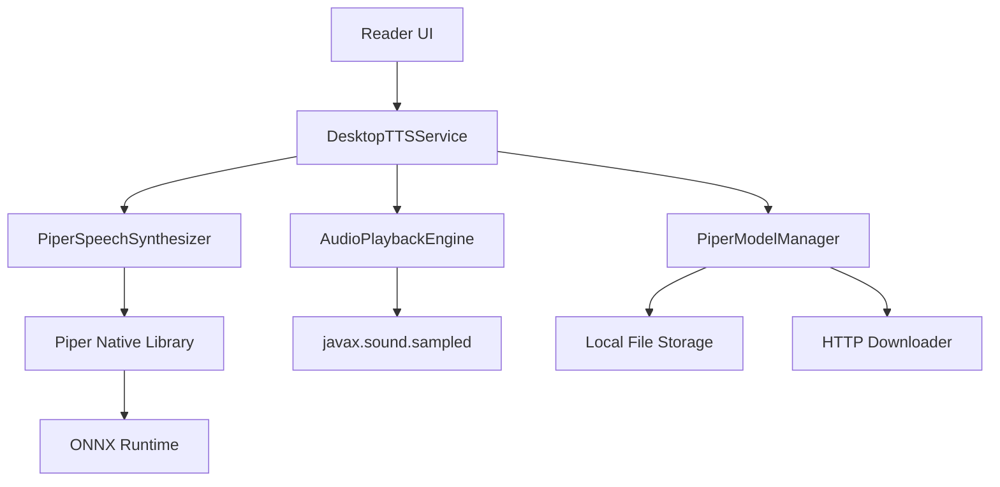

# Piper TTS Desktop Integration - Design Document

## Overview

This design document outlines the architecture and implementation approach for integrating Piper TTS into the IReader desktop application. Piper is an open-source neural text-to-speech system that will replace the current simulated reading approach with actual high-quality audio synthesis. The integration will be desktop-only and will maintain compatibility with the existing TTS architecture while adding real audio playback capabilities.

### Key Design Goals

1. **Offline-First**: All speech synthesis happens locally without network dependencies
2. **High Quality**: Neural TTS provides natural-sounding speech
3. **Responsive**: Playback controls respond within 200ms
4. **Resource Efficient**: Memory usage capped at 500MB, lazy model loading
5. **Backward Compatible**: Maintains existing TTS API and state management
6. **Cross-Platform Desktop**: Works on Windows, macOS, and Linux

## Architecture

### High-Level Component Diagram



### Component Responsibilities

| Component | Responsibility |
|-----------|---------------|
| **DesktopTTSService** | Orchestrates TTS operations, manages state, handles chapter navigation |
| **PiperSpeechSynthesizer** | Interfaces with Piper library, generates audio from text |
| **AudioPlaybackEngine** | Manages audio playback, buffering, and device output |
| **PiperModelManager** | Downloads, stores, and manages voice models |
| **PiperNativeLibrary** | JNI wrapper for Piper C++ library |

## Components and Interfaces

### 1. PiperSpeechSynthesizer

The core component that interfaces with the Piper TTS engine.

```kotlin
interface SpeechSynthesizer {
    /**
     * Initialize the synthesizer with a voice model
     */
    suspend fun initialize(modelPath: String, configPath: String): Result<Unit>
    
    /**
     * Synthesize text to audio
     * @return AudioData containing PCM samples and metadata
     */
    suspend fun synthesize(text: String): Result<AudioData>
    
    /**
     * Synthesize text in streaming mode for responsive playback
     */
    fun synthesizeStream(text: String): Flow<AudioChunk>
    
    /**
     * Get word boundaries for text highlighting
     */
    suspend fun getWordBoundaries(text: String): List<WordBoundary>
    
    /**
     * Release resources
     */
    fun shutdown()
}

class PiperSpeechSynthesizer : SpeechSynthesizer {
    private var piperInstance: Long = 0 // Native pointer
    private val scope = CoroutineScope(Dispatchers.IO + SupervisorJob())
    
    override suspend fun initialize(modelPath: String, configPath: String): Result<Unit> {
        return withContext(Dispatchers.IO) {
            try {
                piperInstance = PiperNative.initialize(modelPath, configPath)
                Result.success(Unit)
            } catch (e: Exception) {
                Result.failure(e)
            }
        }
    }
    
    override suspend fun synthesize(text: String): Result<AudioData> {
        return withContext(Dispatchers.IO) {
            try {
                val audioBytes = PiperNative.synthesize(piperInstance, text)
                val audioData = AudioData(
                    samples = audioBytes,
                    sampleRate = 22050, // Piper default
                    channels = 1,
                    format = AudioFormat.PCM_16
                )
                Result.success(audioData)
            } catch (e: Exception) {
                Result.failure(e)
            }
        }
    }
    
    override fun synthesizeStream(text: String): Flow<AudioChunk> = flow {
        // Split text into sentences for streaming
        val sentences = text.split(Regex("[.!?]+"))
        
        for (sentence in sentences) {
            if (sentence.isBlank()) continue
            
            val result = synthesize(sentence.trim())
            result.onSuccess { audioData ->
                emit(AudioChunk(
                    data = audioData,
                    text = sentence,
                    isLast = sentence == sentences.last()
                ))
            }
        }
    }.flowOn(Dispatchers.IO)
    
    override suspend fun getWordBoundaries(text: String): List<WordBoundary> {
        // Calculate word boundaries based on average phoneme duration
        val words = text.split(Regex("\\s+"))
        val boundaries = mutableListOf<WordBoundary>()
        var currentOffset = 0
        var currentTimeMs = 0L
        
        words.forEach { word ->
            val wordStart = text.indexOf(word, currentOffset)
            val avgPhonemeMs = 80 // Average phoneme duration
            val estimatedDurationMs = word.length * avgPhonemeMs
            
            boundaries.add(WordBoundary(
                word = word,
                startOffset = wordStart,
                endOffset = wordStart + word.length,
                startTimeMs = currentTimeMs,
                endTimeMs = currentTimeMs + estimatedDurationMs
            ))
            
            currentOffset = wordStart + word.length
            currentTimeMs += estimatedDurationMs
        }
        
        return boundaries
    }
    
    override fun shutdown() {
        if (piperInstance != 0L) {
            PiperNative.shutdown(piperInstance)
            piperInstance = 0
        }
    }
}
```

### 2. AudioPlaybackEngine

Manages audio playback using Java Sound API.

```kotlin
interface AudioPlayback {
    /**
     * Play audio data
     */
    suspend fun play(audioData: AudioData)
    
    /**
     * Play audio stream with buffering
     */
    fun playStream(audioFlow: Flow<AudioChunk>): Job
    
    /**
     * Pause playback
     */
    fun pause()
    
    /**
     * Resume playback
     */
    fun resume()
    
    /**
     * Stop playback and clear buffers
     */
    fun stop()
    
    /**
     * Get current playback position in milliseconds
     */
    fun getCurrentPosition(): Long
    
    /**
     * Check if audio is currently playing
     */
    fun isPlaying(): Boolean
}

class AudioPlaybackEngine : AudioPlayback {
    private var sourceDataLine: SourceDataLine? = null
    private var playbackJob: Job? = null
    private val scope = CoroutineScope(Dispatchers.IO + SupervisorJob())
    private var isPaused = false
    private var currentPositionMs = 0L
    
    override suspend fun play(audioData: AudioData) {
        withContext(Dispatchers.IO) {
            initializeAudioLine(audioData)
            sourceDataLine?.start()
            sourceDataLine?.write(audioData.samples, 0, audioData.samples.size)
            sourceDataLine?.drain()
        }
    }
    
    override fun playStream(audioFlow: Flow<AudioChunk>): Job {
        return scope.launch {
            audioFlow.collect { chunk ->
                while (isPaused) {
                    delay(100)
                }
                
                if (sourceDataLine == null) {
                    initializeAudioLine(chunk.data)
                    sourceDataLine?.start()
                }
                
                sourceDataLine?.write(chunk.data.samples, 0, chunk.data.samples.size)
                
                // Update position
                val durationMs = (chunk.data.samples.size / 
                    (chunk.data.sampleRate * chunk.data.channels * 2)) * 1000
                currentPositionMs += durationMs
            }
        }
    }
    
    override fun pause() {
        isPaused = true
        sourceDataLine?.stop()
    }
    
    override fun resume() {
        isPaused = false
        sourceDataLine?.start()
    }
    
    override fun stop() {
        playbackJob?.cancel()
        sourceDataLine?.stop()
        sourceDataLine?.flush()
        sourceDataLine?.close()
        sourceDataLine = null
        currentPositionMs = 0L
        isPaused = false
    }
    
    override fun getCurrentPosition(): Long = currentPositionMs
    
    override fun isPlaying(): Boolean = 
        sourceDataLine?.isActive == true && !isPaused
    
    private fun initializeAudioLine(audioData: AudioData) {
        val format = AudioFormat(
            audioData.sampleRate.toFloat(),
            16, // 16-bit
            audioData.channels,
            true, // signed
            false // little-endian
        )
        
        val info = DataLine.Info(SourceDataLine::class.java, format)
        sourceDataLine = AudioSystem.getLine(info) as SourceDataLine
        sourceDataLine?.open(format, 8192) // 8KB buffer
    }
}
```

### 3. PiperModelManager

Manages downloading and storing voice models.

```kotlin
data class VoiceModel(
    val id: String,
    val name: String,
    val language: String,
    val quality: Quality,
    val gender: Gender,
    val sizeBytes: Long,
    val modelUrl: String,
    val configUrl: String,
    val isDownloaded: Boolean = false
) {
    enum class Quality { LOW, MEDIUM, HIGH }
    enum class Gender { MALE, FEMALE, NEUTRAL }
}

interface ModelManager {
    /**
     * Get list of available voice models
     */
    suspend fun getAvailableModels(): List<VoiceModel>
    
    /**
     * Download a voice model
     */
    suspend fun downloadModel(model: VoiceModel): Flow<DownloadProgress>
    
    /**
     * Get list of downloaded models
     */
    suspend fun getDownloadedModels(): List<VoiceModel>
    
    /**
     * Delete a downloaded model
     */
    suspend fun deleteModel(modelId: String): Result<Unit>
    
    /**
     * Get paths for a downloaded model
     */
    fun getModelPaths(modelId: String): ModelPaths?
}

class PiperModelManager(
    private val appDataDir: File
) : ModelManager {
    private val modelsDir = File(appDataDir, "piper_models")
    private val httpClient = HttpClient()
    
    init {
        modelsDir.mkdirs()
    }
    
    override suspend fun getAvailableModels(): List<VoiceModel> {
        // Load from embedded JSON or fetch from Piper repository
        return loadModelsFromResource()
    }
    
    override suspend fun downloadModel(model: VoiceModel): Flow<DownloadProgress> = flow {
        val modelDir = File(modelsDir, model.id)
        modelDir.mkdirs()
        
        val modelFile = File(modelDir, "model.onnx")
        val configFile = File(modelDir, "config.json")
        
        // Download model file
        emit(DownloadProgress(0, model.sizeBytes, "Downloading model..."))
        downloadFile(model.modelUrl, modelFile) { progress ->
            emit(DownloadProgress(progress, model.sizeBytes, "Downloading model..."))
        }
        
        // Download config file
        emit(DownloadProgress(model.sizeBytes, model.sizeBytes, "Downloading config..."))
        downloadFile(model.configUrl, configFile)
        
        // Verify integrity
        emit(DownloadProgress(model.sizeBytes, model.sizeBytes, "Verifying..."))
        verifyModelIntegrity(modelFile, configFile)
        
        emit(DownloadProgress(model.sizeBytes, model.sizeBytes, "Complete"))
    }.flowOn(Dispatchers.IO)
    
    override suspend fun getDownloadedModels(): List<VoiceModel> {
        val allModels = getAvailableModels()
        return allModels.filter { model ->
            val paths = getModelPaths(model.id)
            paths != null && File(paths.modelPath).exists() && File(paths.configPath).exists()
        }.map { it.copy(isDownloaded = true) }
    }
    
    override suspend fun deleteModel(modelId: String): Result<Unit> {
        return try {
            val modelDir = File(modelsDir, modelId)
            modelDir.deleteRecursively()
            Result.success(Unit)
        } catch (e: Exception) {
            Result.failure(e)
        }
    }
    
    override fun getModelPaths(modelId: String): ModelPaths? {
        val modelDir = File(modelsDir, modelId)
        val modelFile = File(modelDir, "model.onnx")
        val configFile = File(modelDir, "config.json")
        
        return if (modelFile.exists() && configFile.exists()) {
            ModelPaths(modelFile.absolutePath, configFile.absolutePath)
        } else null
    }
    
    private suspend fun loadModelsFromResource(): List<VoiceModel> {
        // Load from embedded models.json resource
        val json = this::class.java.getResourceAsStream("/piper_models.json")
            ?.bufferedReader()?.readText()
            ?: return emptyList()
        
        return Json.decodeFromString(json)
    }
    
    private suspend fun downloadFile(
        url: String,
        destination: File,
        onProgress: suspend (Long) -> Unit = {}
    ) {
        // Implementation using Ktor or OkHttp
    }
    
    private fun verifyModelIntegrity(modelFile: File, configFile: File) {
        // Verify files are valid
        require(modelFile.length() > 0) { "Model file is empty" }
        require(configFile.length() > 0) { "Config file is empty" }
    }
}

data class ModelPaths(
    val modelPath: String,
    val configPath: String
)

data class DownloadProgress(
    val downloaded: Long,
    val total: Long,
    val status: String
)
```

### 4. PiperNativeLibrary (JNI Wrapper)

JNI interface to the Piper C++ library.

```kotlin
object PiperNative {
    init {
        System.loadLibrary("piper_jni")
    }
    
    /**
     * Initialize Piper with model and config
     * @return Native pointer to Piper instance
     */
    external fun initialize(modelPath: String, configPath: String): Long
    
    /**
     * Synthesize text to audio
     * @return PCM audio data as byte array
     */
    external fun synthesize(instance: Long, text: String): ByteArray
    
    /**
     * Set speech rate (0.5 - 2.0)
     */
    external fun setSpeechRate(instance: Long, rate: Float)
    
    /**
     * Shutdown and free resources
     */
    external fun shutdown(instance: Long)
}
```

### 5. Enhanced DesktopTTSService

Updated service that integrates Piper components.

```kotlin
class DesktopTTSService : KoinComponent {
    // Existing dependencies...
    private val synthesizer: PiperSpeechSynthesizer by inject()
    private val audioEngine: AudioPlaybackEngine by inject()
    private val modelManager: PiperModelManager by inject()
    
    private var wordBoundaryJob: Job? = null
    
    suspend fun initialize() {
        state = DesktopTTSState()
        readPrefs()
        
        // Load selected voice model
        val selectedModelId = appPrefs.selectedPiperModel().get()
        if (selectedModelId.isNotEmpty()) {
            loadVoiceModel(selectedModelId)
        }
    }
    
    private suspend fun loadVoiceModel(modelId: String) {
        val paths = modelManager.getModelPaths(modelId)
        if (paths != null) {
            synthesizer.initialize(paths.modelPath, paths.configPath)
                .onFailure { error ->
                    Log.error { "Failed to load voice model: $error" }
                    // Fall back to simulation mode
                }
        }
    }
    
    private suspend fun readText() {
        val content = state.ttsContent?.value ?: return
        
        if (state.currentReadingParagraph >= content.size) {
            handleEndOfChapter()
            return
        }
        
        val text = content[state.currentReadingParagraph]
        state.utteranceId = state.currentReadingParagraph.toString()
        
        speechJob = serviceScope.launch {
            try {
                // Generate audio using Piper
                val audioResult = synthesizer.synthesize(text)
                
                audioResult.onSuccess { audioData ->
                    // Start word boundary tracking
                    startWordBoundaryTracking(text)
                    
                    // Play audio
                    audioEngine.play(audioData)
                    
                    // Check sleep time
                    checkSleepTime()
                    
                    // Move to next paragraph
                    if (state.isPlaying) {
                        advanceToNextParagraph()
                    }
                }.onFailure { error ->
                    Log.error { "Speech synthesis failed: $error" }
                    // Skip to next paragraph
                    advanceToNextParagraph()
                }
            } catch (e: CancellationException) {
                audioEngine.stop()
            }
        }
    }
    
    private fun startWordBoundaryTracking(text: String) {
        wordBoundaryJob?.cancel()
        wordBoundaryJob = serviceScope.launch {
            val boundaries = synthesizer.getWordBoundaries(text)
            val startTime = System.currentTimeMillis()
            
            for (boundary in boundaries) {
                val elapsed = System.currentTimeMillis() - startTime
                val delay = boundary.startTimeMs - elapsed
                
                if (delay > 0) {
                    delay(delay)
                }
                
                // Emit word boundary event for UI highlighting
                state.currentWordBoundary = boundary
            }
        }
    }
    
    private fun pauseReading() {
        state.isPlaying = false
        audioEngine.pause()
        speechJob?.cancel()
        wordBoundaryJob?.cancel()
    }
    
    private fun stopReading() {
        state.isPlaying = false
        audioEngine.stop()
        speechJob?.cancel()
        wordBoundaryJob?.cancel()
        state.currentReadingParagraph = 0
        state.currentWordBoundary = null
    }
    
    override fun shutdown() {
        stopReading()
        synthesizer.shutdown()
        serviceJob?.cancel()
    }
}
```

## Data Models

### Core Data Structures

```kotlin
data class AudioData(
    val samples: ByteArray,
    val sampleRate: Int,
    val channels: Int,
    val format: AudioFormat
) {
    enum class AudioFormat {
        PCM_16, PCM_24, PCM_32
    }
}

data class AudioChunk(
    val data: AudioData,
    val text: String,
    val isLast: Boolean
)

data class WordBoundary(
    val word: String,
    val startOffset: Int,
    val endOffset: Int,
    val startTimeMs: Long,
    val endTimeMs: Long
)
```

### State Extensions

```kotlin
// Add to DesktopTTSState
class DesktopTTSState : TTSState {
    // Existing properties...
    
    var currentWordBoundary by mutableStateOf<WordBoundary?>(null)
    var availableVoiceModels by mutableStateOf<List<VoiceModel>>(emptyList())
    var selectedVoiceModel by mutableStateOf<VoiceModel?>(null)
    var isDownloadingModel by mutableStateOf(false)
    var downloadProgress by mutableStateOf<DownloadProgress?>(null)
}
```

## Error Handling

### Error Types and Recovery Strategies

```kotlin
sealed class TTSError {
    data class ModelLoadError(val message: String) : TTSError()
    data class SynthesisError(val message: String) : TTSError()
    data class AudioPlaybackError(val message: String) : TTSError()
    data class ModelDownloadError(val message: String) : TTSError()
    data class InsufficientStorageError(val required: Long, val available: Long) : TTSError()
}

class TTSErrorHandler {
    fun handle(error: TTSError, service: DesktopTTSService) {
        when (error) {
            is TTSError.ModelLoadError -> {
                Log.error { "Model load failed: ${error.message}" }
                // Fall back to simulation mode
                service.enableSimulationMode()
                showUserNotification("TTS model failed to load. Using simulation mode.")
            }
            
            is TTSError.SynthesisError -> {
                Log.error { "Synthesis failed: ${error.message}" }
                // Skip to next paragraph
                service.skipToNextParagraph()
            }
            
            is TTSError.AudioPlaybackError -> {
                Log.error { "Audio playback failed: ${error.message}" }
                showUserNotification("Audio playback error. Please check your audio device.")
            }
            
            is TTSError.ModelDownloadError -> {
                Log.error { "Model download failed: ${error.message}" }
                showUserNotification("Failed to download voice model. Please try again.")
            }
            
            is TTSError.InsufficientStorageError -> {
                val requiredMB = error.required / (1024 * 1024)
                showUserNotification("Insufficient storage. Need ${requiredMB}MB free space.")
            }
        }
    }
}
```

## Testing Strategy

### Unit Tests

```kotlin
class PiperSpeechSynthesizerTest {
    @Test
    fun `synthesize returns audio data for valid text`() = runTest {
        val synthesizer = PiperSpeechSynthesizer()
        synthesizer.initialize(testModelPath, testConfigPath)
        
        val result = synthesizer.synthesize("Hello world")
        
        assertTrue(result.isSuccess)
        val audioData = result.getOrNull()
        assertNotNull(audioData)
        assertTrue(audioData!!.samples.isNotEmpty())
    }
    
    @Test
    fun `getWordBoundaries returns correct boundaries`() = runTest {
        val synthesizer = PiperSpeechSynthesizer()
        val text = "Hello world test"
        
        val boundaries = synthesizer.getWordBoundaries(text)
        
        assertEquals(3, boundaries.size)
        assertEquals("Hello", boundaries[0].word)
        assertEquals("world", boundaries[1].word)
        assertEquals("test", boundaries[2].word)
    }
}

class AudioPlaybackEngineTest {
    @Test
    fun `play starts and completes audio playback`() = runTest {
        val engine = AudioPlaybackEngine()
        val audioData = createTestAudioData()
        
        engine.play(audioData)
        
        assertFalse(engine.isPlaying())
    }
    
    @Test
    fun `pause stops playback`() = runTest {
        val engine = AudioPlaybackEngine()
        val audioFlow = flowOf(createTestAudioChunk())
        
        engine.playStream(audioFlow)
        delay(100)
        engine.pause()
        
        assertFalse(engine.isPlaying())
    }
}

class PiperModelManagerTest {
    @Test
    fun `downloadModel downloads and verifies model`() = runTest {
        val manager = PiperModelManager(testDir)
        val model = createTestVoiceModel()
        
        manager.downloadModel(model).collect { progress ->
            assertTrue(progress.downloaded <= progress.total)
        }
        
        val paths = manager.getModelPaths(model.id)
        assertNotNull(paths)
        assertTrue(File(paths!!.modelPath).exists())
    }
}
```

### Integration Tests

```kotlin
class DesktopTTSServiceIntegrationTest {
    @Test
    fun `full TTS flow from text to audio`() = runTest {
        val service = DesktopTTSService()
        service.initialize()
        
        // Load test chapter
        service.startReading(bookId = 1, chapterId = 1)
        
        // Start playback
        service.startService(DesktopTTSService.ACTION_PLAY)
        
        delay(2000) // Let it play for 2 seconds
        
        assertTrue(service.state.isPlaying)
        assertTrue(service.state.currentReadingParagraph >= 0)
        
        // Pause
        service.startService(DesktopTTSService.ACTION_PAUSE)
        assertFalse(service.state.isPlaying)
        
        service.shutdown()
    }
}
```

## Performance Considerations

### Memory Management

1. **Model Loading**: Load models lazily and unload after 5 minutes of inactivity
2. **Audio Buffering**: Use 8KB buffers for streaming playback
3. **Text Chunking**: Process text in sentence-sized chunks (max 500 characters)
4. **Cache Limits**: Limit audio cache to 50MB

### CPU Optimization

1. **ONNX Runtime**: Utilize hardware acceleration (CPU SIMD, GPU if available)
2. **Async Processing**: Generate audio on IO dispatcher
3. **Streaming**: Start playback before full chapter synthesis

### Disk Usage

1. **Model Storage**: ~50-100MB per voice model
2. **Audio Cache**: Optional, disabled by default
3. **Cleanup**: Auto-delete unused models after 30 days

## Platform-Specific Considerations

### Windows

- Use WASAPI for low-latency audio
- Bundle ONNX Runtime DLL
- Handle Windows Defender SmartScreen for native libraries

### macOS

- Use Core Audio for audio playback
- Sign native libraries for Gatekeeper
- Request microphone permission (even though we don't use it, some TTS engines require it)

### Linux

- Use ALSA or PulseAudio
- Provide both .so and .deb packages
- Handle different audio server configurations

## Deployment

### Native Library Packaging

```
desktop/
  src/
    desktopMain/
      resources/
        native/
          windows-x64/
            piper_jni.dll
            onnxruntime.dll
          macos-x64/
            libpiper_jni.dylib
            libonnxruntime.dylib
          linux-x64/
            libpiper_jni.so
            libonnxruntime.so
        piper_models.json
```

### Build Configuration

```kotlin
// desktop/build.gradle.kts
compose.desktop {
    application {
        nativeDistributions {
            // Include native libraries
            includeAllModules = true
            
            windows {
                dirChooser = true
                perUserInstall = true
            }
            
            macOS {
                bundleID = "com.ireader.desktop"
                signing {
                    sign.set(true)
                }
            }
            
            linux {
                packageName = "ireader"
                debMaintainer = "ireader@example.com"
            }
        }
    }
}
```

## Migration Path

### Phase 1: Core Integration (Week 1-2)
- Implement PiperNativeLibrary JNI wrapper
- Create PiperSpeechSynthesizer
- Basic audio playback with AudioPlaybackEngine

### Phase 2: Model Management (Week 3)
- Implement PiperModelManager
- Add model download UI
- Persist model preferences

### Phase 3: Enhanced Features (Week 4)
- Word boundary tracking and highlighting
- Streaming synthesis for long chapters
- Error handling and fallback modes

### Phase 4: Polish (Week 5)
- Performance optimization
- Cross-platform testing
- Documentation and user guide

## Future Enhancements

1. **Voice Cloning**: Allow users to train custom voices
2. **SSML Support**: Enable advanced speech control (emphasis, pauses, etc.)
3. **Multi-Voice**: Different voices for dialogue/narration
4. **Background Playback**: Continue playing when app is minimized
5. **Export Audio**: Save chapters as MP3/M4A files
