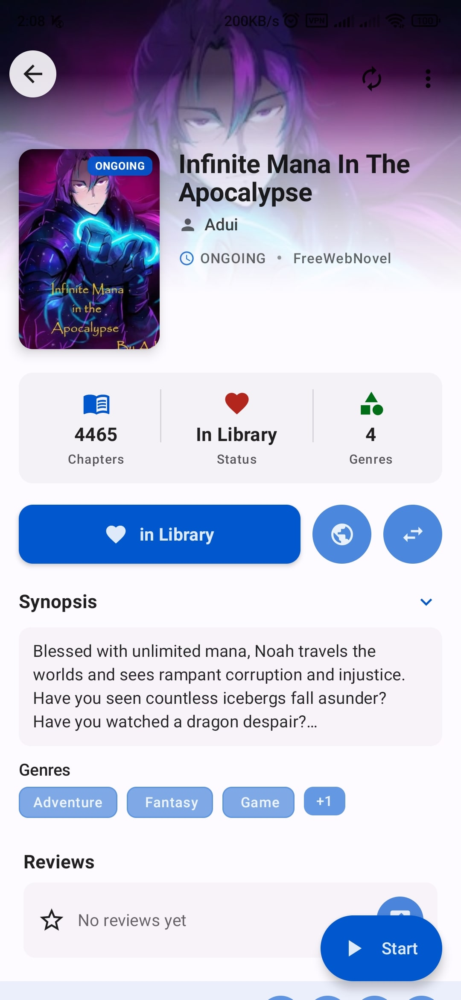
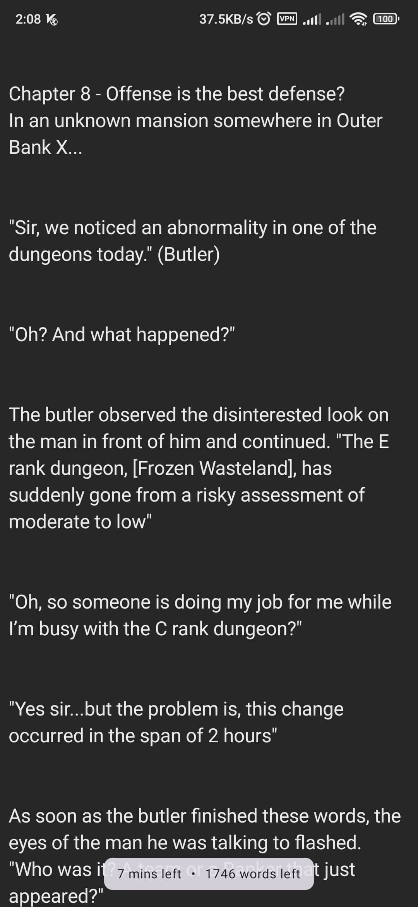
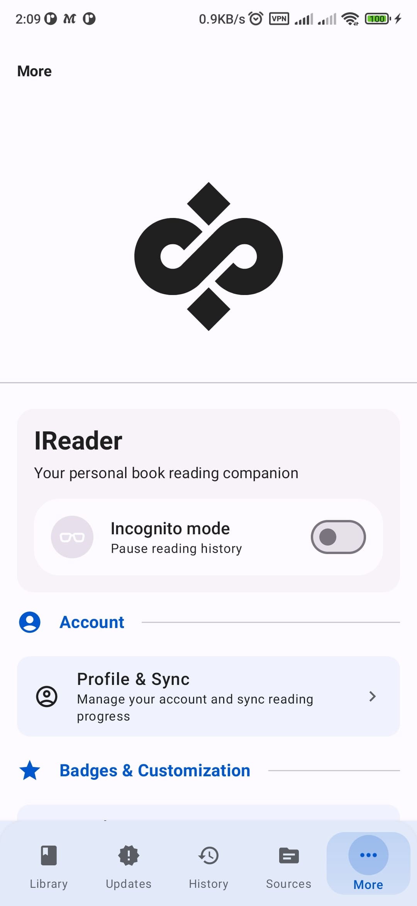
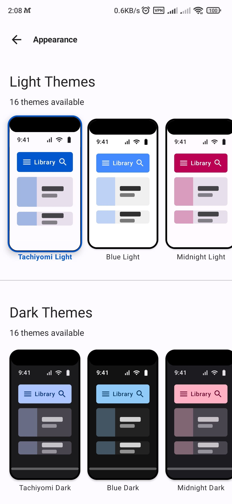
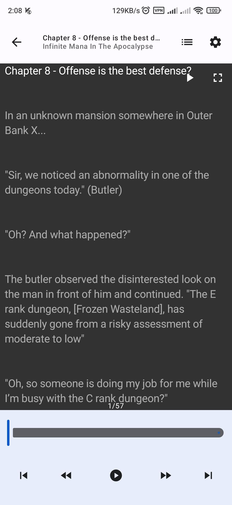
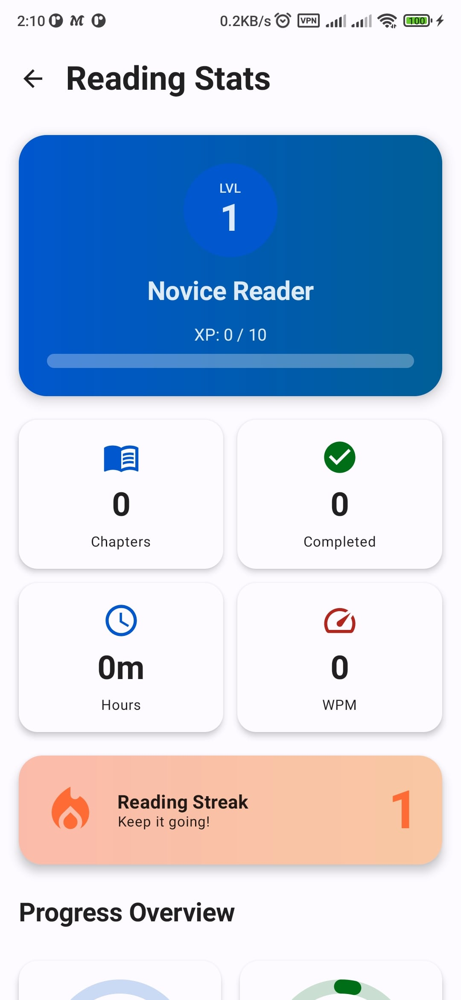
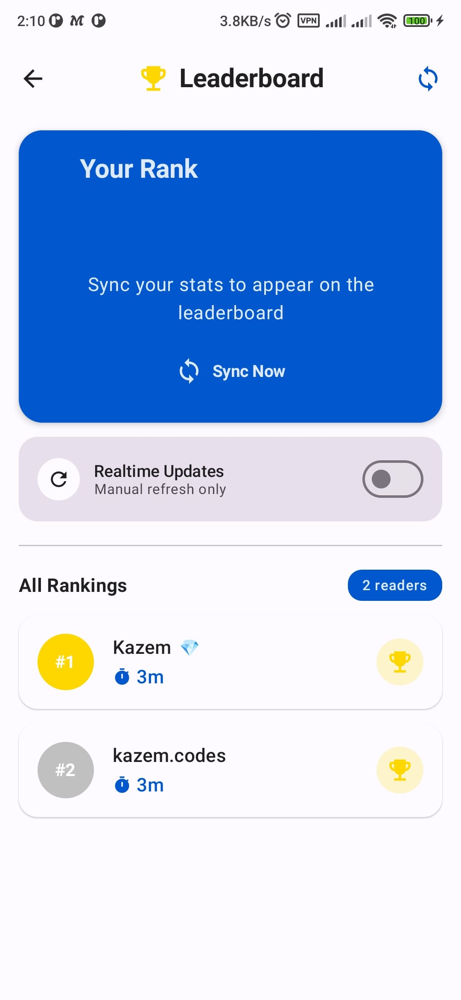
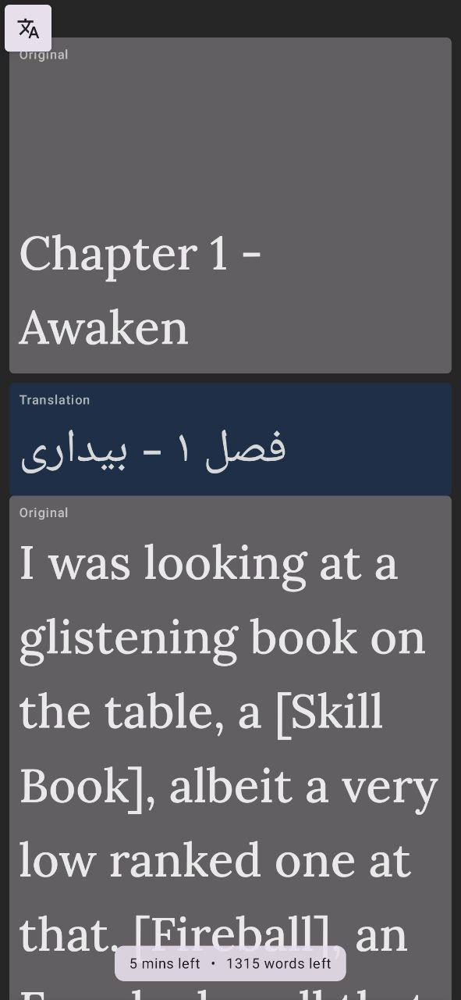

# 📖 IReader

**A free and open-source novel reader for Android and Desktop**

[Download](https://github.com/IReaderorg/IReader/releases) • [Documentation](docs/README.md) • [Wiki](https://codewiki.google/github.com/ireaderorg/ireader) • [中文](README_zh.md)

A cross-platform novel reader with support for multiple sources through extensions and JavaScript plugins. Read your favorite web novels offline with a customizable reading experience.

## ✨ Features

- 📱 Android and Desktop support
- 📚 Multiple sources via extensions and JavaScript plugins
- 📥 Offline reading with chapter downloads
- 🔍 Search across multiple sources
- 📖 Library management with categories and filters
- 🌙 Dark mode and customizable themes
- 🔊 AI Text-to-Speech (Desktop)
- 📦 Import Legado/阅读 book sources
- 🚫 No ads or tracking

## 📲 Installation

### Android
Download the latest APK from [GitHub Releases](https://github.com/IReaderorg/IReader/releases)

**Requirements:** Android 7.0 or higher

### Desktop
Download the latest release from [GitHub Releases](https://github.com/IReaderorg/IReader/releases)

**Supported:** Windows, macOS, Linux

## 🚀 Quick Start

### Using LNReader Sources (Recommended)

IReader now supports LNReader sources! Follow these steps:

1. **Add LNReader Repository**
   - Go to **Settings → Repository**
   - Tap the **Add icon (+)**
   - Select **Quick Add Popular Repo**
   - Choose **LNReader**
   - Save and refresh remote sources in the Source screen

2. **Storage Permissions (Optional)**
   - By default, LNReader sources are saved to app cache (no permissions needed)
   - To save sources to external storage for easier access, disable **"Saved Sources to Cache"** in Settings → General
   - If using external storage, grant storage permissions when prompted

3. **Start Reading**
   - Browse sources to find novels
   - Add books to your library
   - Download chapters for offline reading

> **Note:** IReader no longer supports the in-app default repository. You must add repositories manually in Settings.

### Using Legado Sources

IReader supports importing book sources from [Legado/阅读](https://github.com/gedoor/legado), a popular Chinese novel reader:

1. Go to **More → Community → Legado Sources**
2. Enter a Legado source URL or paste JSON directly
3. Select sources to import and tap **Import**

Imported sources appear immediately in your sources list.

## 📖 Documentation

- **[📚 Full Documentation Index](docs/README.md)** - Start here for all guides
- [Text-to-Speech Guide](docs/guides/tts.md)
- [Sources & Extensions](docs/guides/sources.md)
- [Sync & Backup](docs/guides/sync_backup.md)
- [Developer Documentation](docs/developer/README.md)

## 🌍 Contributing

Contributions are welcome! See [CONTRIBUTING.md](CONTRIBUTING.md) for guidelines.

- Translations: [Weblate](https://hosted.weblate.org/projects/ireader/ireader/)
- Extensions: [IReader Extensions](https://github.com/IReaderorg/IReader-extensions)

### 🍎 iOS Developer Needed

We're looking for a developer to help wire the iOS module to the main app. All the groundwork is done — the iOS module exists and the core components are ready — but the final integration work remains. @kazemcodes is unable to continue this work due to not having access to a Mac.

The app can also leverage IReader's existing sources since they are compiled to Native/JS, making the integration straightforward.

If you have iOS/macOS development experience and want to help bring IReader to iOS, please reach out!

## 📄 License

Licensed under [Apache 2.0 License](LICENSE)

## 🙏 Acknowledgments

- [LNReader](https://github.com/LNReader/lnreader) – Thank you for maintaing the plugins
- [Tachiyomi](https://github.com/tachiyomiorg/tachiyomi) – Architecture inspiration
- [Piper TTS](https://github.com/rhasspy/piper) – Text-to-speech engine
- All our [contributors](https://github.com/IReaderorg/IReader/graphs/contributors)

## Screenshots

| Library | Book Detail | Reader |
| ------- | ----------- | ------ |
|  |  |  |

| Settings | Theme | TTS |
| -------- | ----- | --- |
|  |  |  |

| Statistics | Leaderboard | Translation |
| ---------- | ----------- | ----------- |
|  |  |  |

