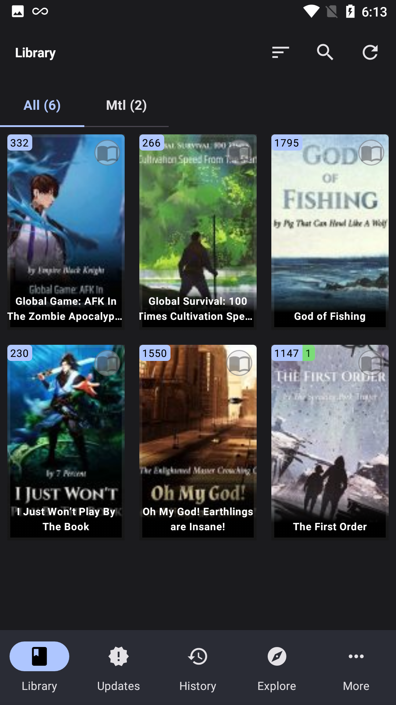
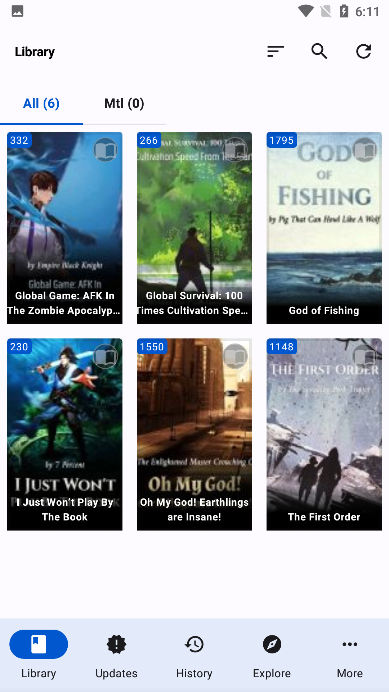
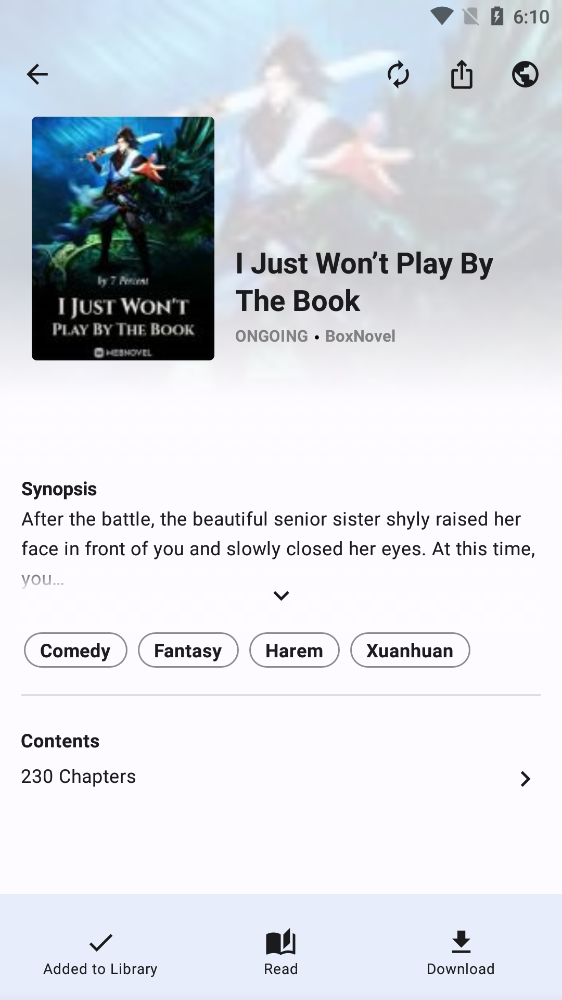

# 📖 IReader

**A free and open-source novel reader for Android and Desktop**

[Download](https://ireaderorg.netlify.app/download/) • [Documentation](docs/README.md) • [Discord](https://discord.gg/your-discord-invite) • [Contributing](#-contributing)

IReader is a powerful, cross-platform novel reader that brings your favorite web novels to life. With support for hundreds of sources through extensions and JavaScript plugins, offline reading, and advanced features like AI-powered text-to-speech, IReader delivers a premium reading experience without ads or tracking.

---

## ✨ Features

### Core Features
- 📱 **Cross-Platform** – Native Android and Desktop (Windows, macOS, Linux) support
- 📚 **Extensive Source Support** – Access hundreds of novel sources via extensions and JavaScript plugins
- 📥 **Offline Reading** – Download chapters and read anywhere, anytime
- 🔍 **Smart Search** – Find novels across multiple sources simultaneously
- 📖 **Library Management** – Organize with categories, filters, and sorting options
- 🔄 **Auto-Updates** – Automatic chapter updates for your library
- 💾 **Backup & Restore** – Protect your library data with cloud or local backups

### Reading Experience
- ⚙️ **Highly Customizable** – Multiple reading directions, fonts, themes, and layouts
- 🌙 **Dark Mode** – AMOLED-friendly dark theme for comfortable night reading
- 🎨 **Theme Engine** – Create and share custom color schemes
- 📏 **Reading Settings** – Adjust font size, line spacing, margins, and more
- 🔖 **Bookmarks** – Mark important passages and scenes
- 📍 **Reading Progress** – Automatic progress tracking and sync

### Advanced Features
- 🔊 **AI Text-to-Speech** (Desktop) – Natural-sounding voices powered by Piper TTS
- 🔌 **JavaScript Plugin System** – LNReader-compatible plugins for maximum flexibility
- 🌐 **Multi-Language** – Interface available in multiple languages
- 🚫 **Ad-Free & Privacy-Focused** – No ads, tracking, or account required
- ⚡ **Performance Optimized** – Fast loading and smooth scrolling

---

## 🛠 Installation

### 📲 Android

**Minimum Requirements:** Android 7.0 (API 24) or higher

1. **Download the APK**
   - [GitHub Releases](https://github.com/IReaderorg/IReader/releases) (recommended)
   - [Official Website](https://ireaderorg.netlify.app/download/)

2. **Install the APK**
   - Open the downloaded file on your Android device
   - Enable "Install from Unknown Sources" if prompted
   - Follow the on-screen installation instructions

### 💻 Desktop

> 🧪 *Desktop version is still under development.*
> Stay tuned to the [GitHub repo](https://github.com/IReaderorg/IReader) for future releases.

**Supported Platforms:**
- Windows 10 or later (x64)
- macOS 10.15 (Catalina) or later (x64)
- Linux (x64) with ALSA or PulseAudio

**System Requirements:**
- 4GB RAM minimum (8GB recommended)
- 500MB free disk space (plus additional space for TTS voice models)
- Working audio output device (for TTS features)

---

## 🚀 Quick Start

### First Time Setup

1. **Launch IReader** on your device
2. **Install Extensions or Plugins**
   - Browse to **Settings → Extensions** to install [IReader Extensions](https://github.com/IReaderorg/IReader-extensions)
   - Or enable **JavaScript Plugins** for LNReader compatibility (see [JS Plugin Guide](#-javascript-plugins))
3. **Browse Catalogs** to discover novels from your installed sources
4. **Add to Library** by tapping the bookmark icon on any novel
5. **Start Reading** and customize your experience in reader settings

### Essential Tips

- **Updating Chapters**: Pull down on your library to check for new chapters
- **Organizing**: Long-press books to add them to categories
- **Customizing**: Tap the settings icon while reading to adjust fonts, themes, and layout
- **Downloading**: Tap the download icon to save chapters for offline reading
- **Searching**: Use the global search to find novels across all sources

For detailed guides, check out our [Documentation](#-documentation).

---

## 🔊 Text-to-Speech (Desktop)

IReader Desktop features **Piper TTS** - an advanced neural text-to-speech system that brings your books to life with natural-sounding AI voices.

### ✨ Key Features

- **🎯 High-Quality Neural Voices** – Natural, expressive speech using AI technology
- **🌐 Offline-First** – Works completely offline once voice models are downloaded
- **🔒 Privacy-Focused** – All processing happens locally, no data sent to external servers
- **🌍 Multi-Language Support** – Voices available in English, Spanish, French, German, and more
- **⚡ Responsive Controls** – Pause, resume, and navigate with <200ms response time
- **📍 Word Highlighting** – Follow along visually as each word is spoken
- **🎚️ Customizable** – Adjust speech rate, volume, and pitch to your preference
- **💾 Efficient** – Optimized resource usage with lazy model loading

### 🚀 Getting Started with TTS

1. **Open a Book** in the reader
2. **Click the TTS Button** (speaker icon) in the toolbar
3. **Download a Voice Model** from the Voice Model Manager
4. **Select Your Voice** and start listening!

### 📥 Voice Models

Voice models are neural networks that generate speech. Each model has different characteristics:

- **Languages**: English (US/UK), Spanish, French, German, Italian, Portuguese, and more
- **Quality Levels**: 
  - Low (~20-30MB) - Fast, good quality
  - Medium (~40-60MB) - Balanced, natural sound
  - High (~80-120MB) - Most expressive and natural
- **Voice Types**: Male, Female, and Neutral voices available

**Recommended Starting Models:**
- English (US): `en_US-lessac-medium` (Female, high quality)
- English (UK): `en_GB-alan-medium` (Male, natural)

### 🎮 Playback Controls

- **Play/Pause** – Start or pause reading
- **Stop** – End playback and return to beginning
- **Next/Previous Paragraph** – Navigate through text
- **Next/Previous Chapter** – Jump between chapters
- **Speed Control** – Adjust from 0.5x to 2.0x speed
- **Volume Control** – Independent TTS volume

### 🛠️ Technical Details

**Powered by Piper TTS:**
- Open-source neural TTS using VITS architecture
- ONNX Runtime for cross-platform compatibility
- Hardware acceleration support (CPU SIMD, GPU when available)
- Memory-efficient with <500MB usage cap

**Audio Backend:**
- Windows: WASAPI (low-latency)
- macOS: Core Audio
- Linux: ALSA/PulseAudio

### 📖 Documentation

- **[TTS Setup Guide](docs/TTS_Setup_Guide.md)** – Complete guide to downloading and configuring voice models
- **[TTS Troubleshooting Guide](docs/TTS_Troubleshooting_Guide.md)** – Solutions to common TTS issues

### 🔄 Fallback Mode

If TTS encounters issues (no models, audio device unavailable, etc.), it automatically switches to simulation mode, allowing you to continue using the app while you resolve the issue.

---

## 🔌 JavaScript Plugins

IReader now supports **JavaScript plugins** compatible with the LNReader ecosystem, giving you access to hundreds of novel sources!

### ✨ Key Features

- **🌐 LNReader Compatibility** – Load plugins from the LNReader plugin repository
- **🔒 Secure Sandboxing** – Plugins run in a secure, isolated environment
- **⚡ High Performance** – Optimized engine with caching and pooling
- **🎯 Advanced Filtering** – Use plugin-defined filters for refined browsing
- **💾 Persistent Storage** – Plugins can cache data for faster loading
- **🔄 Auto-Updates** – Keep plugins up to date automatically
- **📱 Cross-Platform** – Works on both Android and Desktop

### 🚀 Getting Started

#### 1. Enable JavaScript Plugins

1. Open **Settings** → **JavaScript Plugins**
2. Toggle **Enable JavaScript Plugins** to ON
3. Configure settings (optional):
   - Execution timeout (10-60 seconds)
   - Max concurrent executions (1-10)
   - Auto-update plugins
   - Debug mode

#### 2. Install Plugins

**Android:**
- Place `.js` plugin files in: `/data/data/com.ireader/files/js-plugins/`
- Or use a file manager with root access

**Desktop:**
- Place `.js` plugin files in: `~/.ireader/js-plugins/`
- Create the directory if it doesn't exist

#### 3. Find Plugins

Download LNReader plugins from:
- [LNReader Plugins Repository](https://github.com/LNReader/lnreader-plugins)
- Community sources (verify trustworthiness)

**Popular Plugins:**
- NovelBuddy
- LightNovelPub
- ReadLightNovel
- BoxNovel
- NovelFull
- WuxiaWorld
- ScribbleHub
- RoyalRoad

#### 4. Use Plugins

1. Restart IReader or refresh catalogs
2. Browse catalogs – JS plugins appear with their icons
3. Select a plugin to browse novels
4. Apply filters (if supported)
5. Search, read, and enjoy!

### 🛡️ Security

JavaScript plugins run in a **secure sandbox** with:
- Restricted file system access
- Validated network requests
- No access to native APIs
- Code validation before execution
- Memory and timeout limits

### 📊 Performance

- **Plugin Load Time**: < 500ms per plugin
- **Browse/Search**: < 2 seconds
- **Memory Usage**: < 100MB for 10 plugins
- **Startup Impact**: < 200ms

### 🐛 Troubleshooting

**Plugin not loading?**
- Check file extension is `.js`
- Verify plugin syntax is valid
- Enable debug mode in settings
- Check logs for errors

**Plugin running slow?**
- Increase execution timeout in settings
- Check network connection
- Clear plugin cache

**Plugin not appearing?**
- Ensure JS plugins are enabled in settings
- Restart the app
- Verify plugin file is in correct directory

### 📖 Documentation

- **[JS Plugin System](docs/js-plugin-system.md)** – Complete architecture and API documentation
- **[Plugin Development Guide](docs/plugin-development/)** – Create your own plugins
- **[Example Plugins](docs/examples/)** – Sample plugin implementations

---

## 📖 Documentation

Check out our comprehensive wiki for detailed guides:

- [Getting Started](docs/wiki/Getting-Started.md) - Quick setup guide for new users
- [Installing Extensions](docs/wiki/Installing-Extensions.md) - How to add new sources
- [Adding Books](docs/wiki/Adding-Books.md) - Finding and adding books to your library
- [Categories](docs/wiki/Categories.md) - Organizing your book collection
- [Reading Books](docs/wiki/Reading-Books.md) - Customize your reading experience
- [Backup and Restore](docs/wiki/Backup-and-Restore.md) - Protecting your library data
- [Troubleshooting](docs/wiki/Troubleshooting.md) - Solutions to common issues
- [FAQ](docs/wiki/FAQ.md) - Frequently asked questions

### Text-to-Speech Documentation

- [TTS Setup Guide](docs/TTS_Setup_Guide.md) - How to download and configure voice models
- [TTS Troubleshooting Guide](docs/TTS_Troubleshooting_Guide.md) - Solutions to common TTS issues

### Developer Documentation

- [UI Improvements Guide](docs/UI_Improvements_Guide.md) - Comprehensive guide to the enhanced UI components and improvements

---

## 📖 Developer Documentation

Comprehensive documentation for developers is available in the [`docs/`](docs/) directory:

### Architecture & Design
- **[Architecture Guide](docs/ARCHITECTURE.md)** - Clean architecture principles, module structure, and development guidelines
- **[Module Dependencies](docs/MODULE_DEPENDENCIES.md)** - Detailed dependency graph and module relationships
- **[Build Optimization](docs/BUILD_OPTIMIZATION.md)** - Build configuration, dependency management, and performance tips

### Quick Links
- [Documentation Index](docs/README.md) - Complete documentation overview
- [Quick Start for Developers](docs/ARCHITECTURE.md#quick-start)
- [Adding New Features](docs/ARCHITECTURE.md#adding-a-new-feature)

---

## 🌍 Contributing

### 🌐 Translations

- Help translate the app via [Weblate](https://hosted.weblate.org/projects/ireader/ireader/)

### 📦 Create a New Source

- See [Contributing Guide](https://github.com/IReaderorg/IReader-extensions/blob/master/tutorial/CONTRIBUTING.md)

### 💻 Code Contributions

1. Read the [Architecture Guide](docs/ARCHITECTURE.md) to understand the project structure
2. Follow clean architecture principles
3. Write tests for new features
4. Document public APIs with KDoc
5. Submit a pull request

---

## 💬 Community & Support

- 💬 **Discord** – Join our [Discord Server](https://discord.gg/your-discord-invite) for help, updates, and discussions
- 🐛 **Bug Reports** – [Open an issue](https://github.com/IReaderorg/IReader/issues/new) on GitHub
- 💡 **Feature Requests** – Share your ideas in [GitHub Discussions](https://github.com/IReaderorg/IReader/discussions)
- 📖 **Documentation** – Check our [comprehensive docs](docs/README.md) for guides and tutorials

---

## 📄 License

This project is licensed under the [Apache 2.0 License](https://github.com/IReaderorg/IReader/blob/master/LICENSE)

---

## ⭐ Star History

If you find IReader useful, consider giving it a star on GitHub!

---

## 🙏 Acknowledgments

- [Tachiyomi](https://github.com/tachiyomiorg/tachiyomi) – Inspiration for the architecture and design
- [LNReader](https://github.com/LNReader/lnreader) – JavaScript plugin compatibility
- [Piper TTS](https://github.com/rhasspy/piper) – Neural text-to-speech engine
- All our [contributors](https://github.com/IReaderorg/IReader/graphs/contributors) and community members

---

## 📄 Disclaimer

The developer of this application does not have any affiliation with the content providers available. All content is provided by third-party sources.

---

🔗 **Website:** [https://ireaderorg.netlify.app/](https://ireaderorg.netlify.app/)

Made with ❤️ by the IReader community

## Screenshots :camera:

| Views    | Dark                                                       | Light                                                        |
| -------- | ---------------------------------------------------------- | ------------------------------------------------------------ |
| Library  |          |          |
| Book     |                |                |
| Reader     |                |                |

