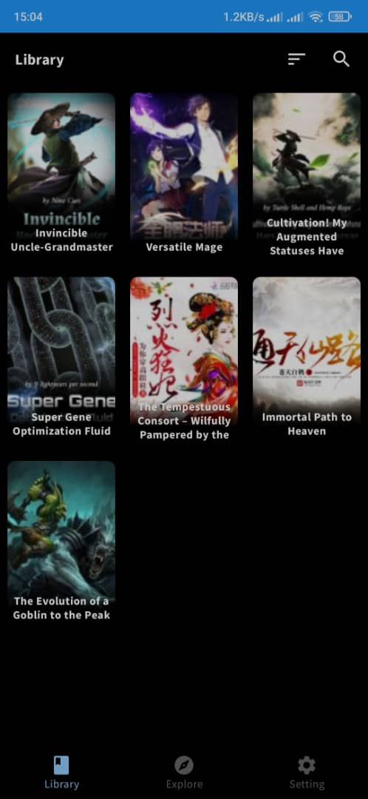
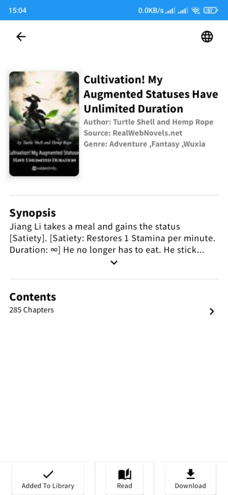
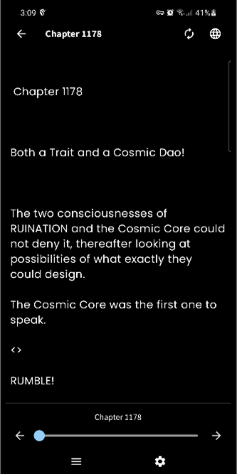
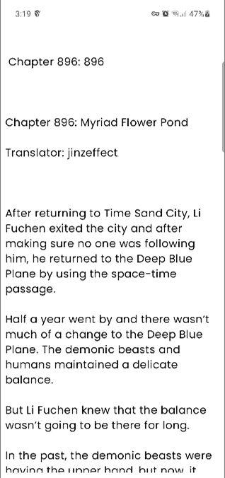

# IReader

IReader is a free and open source applicaiton for Android.

 

| Build | Support Server |
|-------|---------|
| [0.1.5 beta](https://github.com/kazemcodes/Infinity/releases/tag/v0.1.5) | [Discord Server](https://discord.gg/HBU6zD8c5v) |

## Features :sparkles:

- Access all the books available on the website
- Support 7 sources
- Support the offline reading

## Release Page

- You Can Download the App From [Here](https://github.com/kazemcodes/Infinity/releases)

## Contribution
- You can take a look at [here](https://github.com/kazemcodes/Infinity/blob/master/how_to_make_a_source_guide.md), to understand how to create a source for this applicaiton 

## Screenshots :camera:

| Views    | Dark                                                       | Light                                                        |
| -------- | ---------------------------------------------------------- | ------------------------------------------------------------ |
| Library  |          |          |
| Book     |                |                |
| Reader     |                |                |

## License

    Copyright 2015 Javier Tomás

    Licensed under the Apache License, Version 2.0 (the "License");
    you may not use this file except in compliance with the License.
    You may obtain a copy of the License at

    http://www.apache.org/licenses/LICENSE-2.0

    Unless required by applicable law or agreed to in writing, software
    distributed under the License is distributed on an "AS IS" BASIS,
    WITHOUT WARRANTIES OR CONDITIONS OF ANY KIND, either express or implied.
    See the License for the specific language governing permissions and
    limitations under the License.

## Disclaimer

The developer of this application does not have any affiliation with the content providers available.
