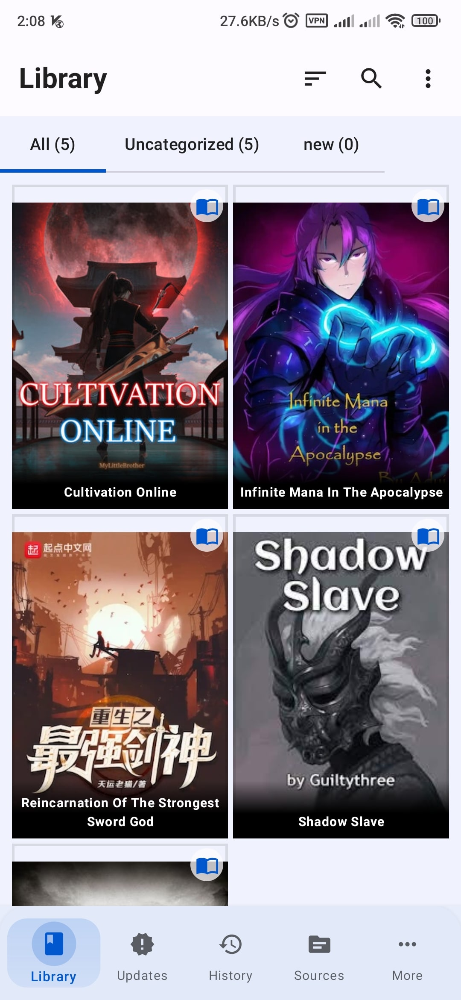
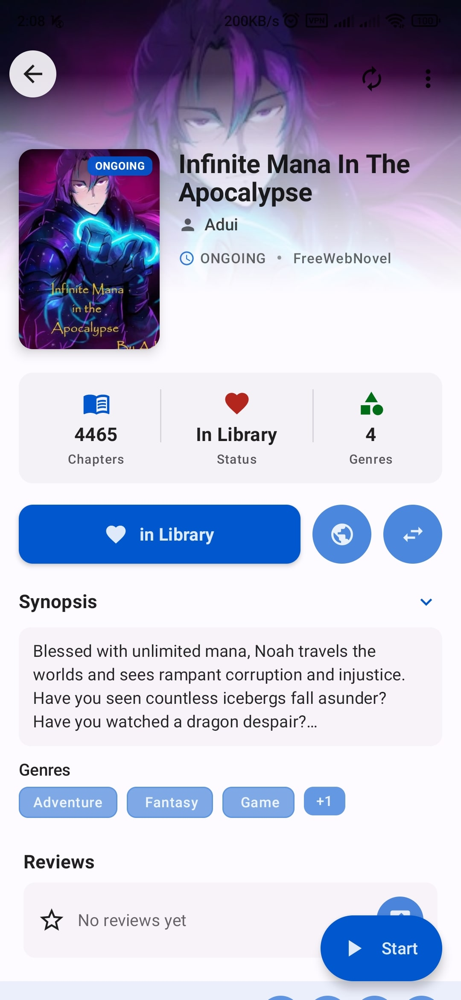
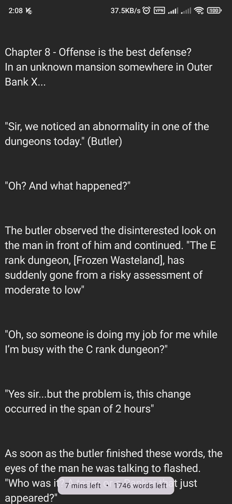
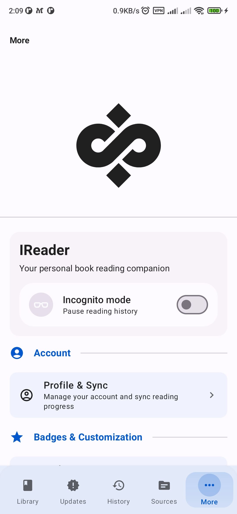
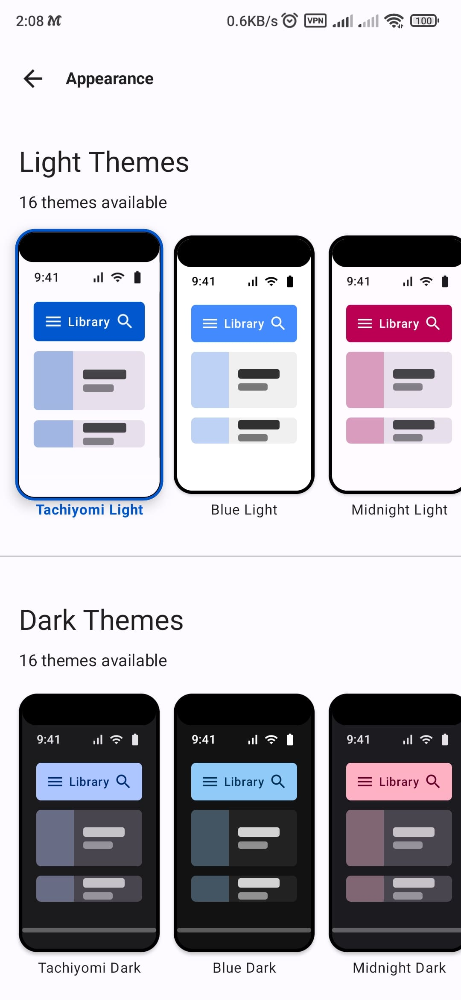
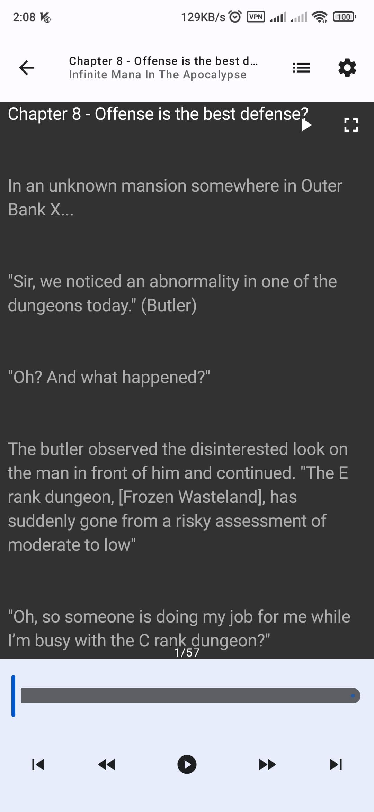
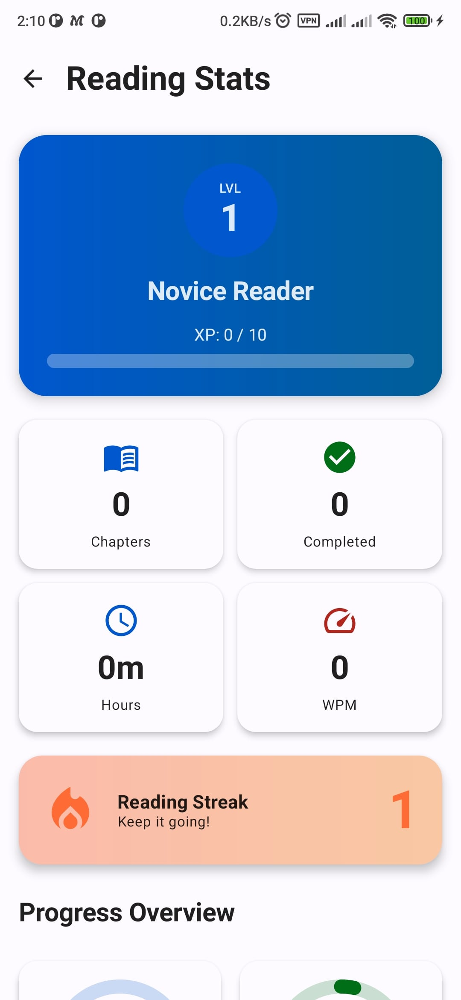
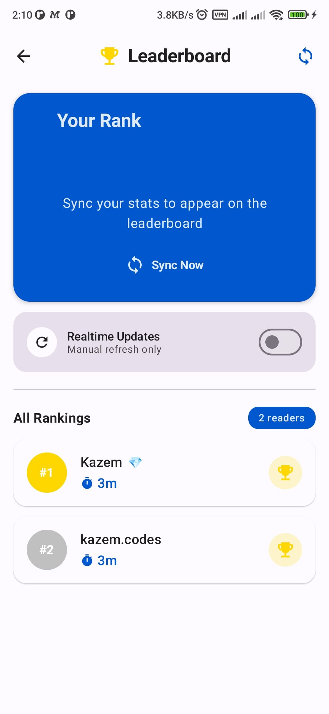
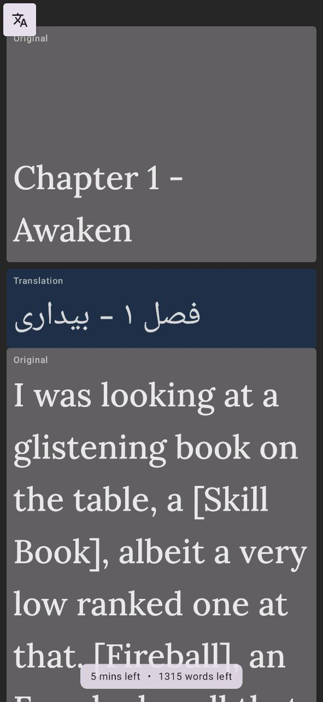

# 📖 IReader - Open Source Reader App for Android & Desktop

**The best free and open-source reader app for novels, light novels, and web novels**

[Download APK](https://github.com/IReaderorg/IReader/releases) • [Website](https://ireaderorg.netlify.app) • [Documentation](docs/README.md) • [中文](README_zh.md)

IReader is a powerful open-source reader app for Android and Desktop. Read light novels, web novels, and ebooks offline with the most customizable reading experience. No ads, no tracking, completely free forever.

**Perfect for:** Light novel readers • Web novel enthusiasts • Ebook lovers • Anyone who wants a privacy-focused reader app

## ✨ Why IReader is the Best Reader App

IReader is the ultimate open-source reader app for novel enthusiasts. Unlike other reader apps, IReader offers:

- 📱 **Cross-Platform** - Android and Desktop (Windows, macOS, Linux) support
- 📚 **Multi-Source Support** - Access novels from multiple sources via extensions and JavaScript plugins
- 📥 **Offline Reading** - Download chapters and read without internet connection
- 🔍 **Smart Search** - Search across multiple sources simultaneously
- 📖 **Library Management** - Organize with categories, filters, and custom collections
- 🌙 **Customizable Themes** - Dark mode, custom themes, and full UI customization
- 🔊 **AI Text-to-Speech** - High-quality TTS powered by Piper (Desktop)
- 📦 **Legado Import** - Import book sources from Legado/阅读
- 🔓 **Privacy-Focused** - No ads, no tracking, no data collection
- ⚡ **Fast & Lightweight** - Optimized performance and battery efficiency

### What Makes This Reader App Different?

**100% Free & Open Source:** No hidden costs, no premium features, no subscriptions. The entire codebase is open for inspection and contribution.

**Privacy First:** Unlike commercial reader apps, IReader doesn't collect your data, show ads, or track your reading habits.

**Highly Customizable:** Every aspect of the reading experience can be adjusted - fonts, spacing, colors, themes, gestures, and more.

**Active Development:** Regular updates, bug fixes, and new features driven by community feedback.

## 📲 Download IReader

### Android Reader App
Download the latest APK from [GitHub Releases](https://github.com/IReaderorg/IReader/releases)

**Requirements:** Android 7.0 or higher

**Why download this reader app?**
- No Google Play restrictions
- Always get the latest features first
- Direct APK installation
- No region locks

### Desktop Reader App
Download the latest release from [GitHub Releases](https://github.com/IReaderorg/IReader/releases)

**Supported Platforms:** Windows, macOS, Linux

**Desktop Features:**
- AI-powered Text-to-Speech
- Larger screen optimization
- Keyboard shortcuts
- Multi-window support

## 🚀 Quick Start

### Using LNReader Sources (Recommended)

IReader now supports LNReader sources! Follow these steps:

1. **Add LNReader Repository**
   - Go to **Settings → Repository**
   - Tap the **Add icon (+)**
   - Select **Quick Add Popular Repo**
   - Choose **LNReader**
   - Save and refresh remote sources in the Source screen

2. **Storage Permissions (Optional)**
   - By default, LNReader sources are saved to app cache (no permissions needed)
   - To save sources to external storage for easier access, disable **"Saved Sources to Cache"** in Settings → General
   - If using external storage, grant storage permissions when prompted

3. **Start Reading**
   - Browse sources to find novels
   - Add books to your library
   - Download chapters for offline reading

> **Note:** IReader no longer supports the in-app default repository. You must add repositories manually in Settings.

### Using Legado Sources

IReader supports importing book sources from [Legado/阅读](https://github.com/gedoor/legado), a popular Chinese novel reader:

1. Go to **More → Community → Legado Sources**
2. Enter a Legado source URL or paste JSON directly
3. Select sources to import and tap **Import**

Imported sources appear immediately in your sources list.

## 📖 Documentation

- **[📚 Full Documentation Index](docs/README.md)** - Start here for all guides
- **[❓ Frequently Asked Questions](docs/guides/faq.md)** ⭐ NEW - Common questions and answers
- [Text-to-Speech Guide](docs/guides/tts.md)
- [Sources & Extensions](docs/guides/sources.md)
- [Extension Repository Guide](docs/guides/extension_repository_guide.md) - How to add repositories
- [Sync & Backup](docs/guides/sync_backup.md)
- [Developer Documentation](docs/developer/README.md)

## 🌍 Contributing

Contributions are welcome! See [CONTRIBUTING.md](CONTRIBUTING.md) for guidelines.

- Translations: [Weblate](https://hosted.weblate.org/projects/ireader/ireader/)
- Extensions: [IReader Extensions](https://github.com/IReaderorg/IReader-extensions)

### 🍎 iOS Developer Needed

We're looking for a developer to help wire the iOS module to the main app. All the groundwork is done — the iOS module exists and the core components are ready — but the final integration work remains. @kazemcodes is unable to continue this work due to not having access to a Mac.

The app can also leverage IReader's existing sources since they are compiled to Native/JS, making the integration straightforward.

If you have iOS/macOS development experience and want to help bring IReader to iOS, please reach out!

## 📄 License

Licensed under [Apache 2.0 License](LICENSE)

## 🙏 Acknowledgments

- [LNReader](https://github.com/LNReader/lnreader) – Thank you for maintaing the plugins
- [Tachiyomi](https://github.com/tachiyomiorg/tachiyomi) – Architecture inspiration
- [Piper TTS](https://github.com/rhasspy/piper) – Text-to-speech engine
- All our [contributors](https://github.com/IReaderorg/IReader/graphs/contributors)

---

## 🔍 Keywords

reader app, android reader app, open source reader app, novel reader app, light novel reader, web novel reader, ebook reader app, free reader app, offline reader app, cross-platform reader, desktop reader app, privacy reader app, customizable reader app, tachiyomi alternative, legado alternative, best reader app, novel app, book reader, reading app, android novel reader, ios reader app alternative

**IReader** - The open-source reader app that respects your privacy and gives you complete control over your reading experience.

## Screenshots

| Library | Book Detail | Reader |
| ------- | ----------- | ------ |
|  |  |  |

| Settings | Theme | TTS |
| -------- | ----- | --- |
|  |  |  |

| Statistics | Leaderboard | Translation |
| ---------- | ----------- | ----------- |
|  |  |  |

