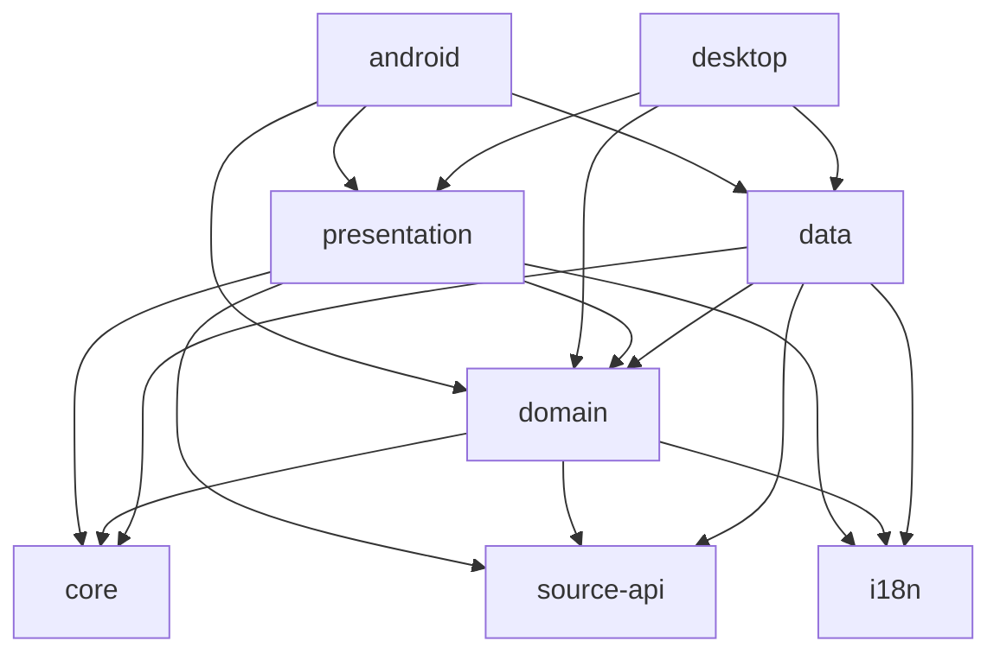

# IReader Architecture Guide

## Overview

IReader is a Kotlin Multiplatform (KMP) application that follows Clean Architecture principles. This guide explains the architecture, module structure, and development practices.

## Table of Contents

1. [Architecture Principles](#architecture-principles)
2. [Module Structure](#module-structure)
3. [Dependency Flow](#dependency-flow)
4. [Layer Responsibilities](#layer-responsibilities)
5. [Development Guidelines](#development-guidelines)
6. [Build Configuration](#build-configuration)

## Architecture Principles

IReader follows **Clean Architecture** with three main layers:

```
┌─────────────────────────────────────────┐
│         Presentation Layer              │
│  (UI, ViewModels, Compose Screens)      │
└──────────────┬──────────────────────────┘
               │ depends on
               ▼
┌─────────────────────────────────────────┐
│          Domain Layer                   │
│  (Use Cases, Entities, Repository       │
│   Interfaces, Business Rules)           │
└──────────────┬──────────────────────────┘
               │ depends on
               ▼
┌─────────────────────────────────────────┐
│           Data Layer                    │
│  (Repository Implementations,           │
│   Database, Network, Mappers)           │
└─────────────────────────────────────────┘
```

### Key Principles

1. **Dependency Rule**: Dependencies point inward. Inner layers know nothing about outer layers.
2. **Abstraction**: Domain layer defines interfaces; data layer implements them.
3. **Single Responsibility**: Each module has one clear purpose.
4. **Testability**: Business logic is isolated and easily testable.

## Module Structure

### Core Modules

#### `:domain`
**Purpose**: Contains business logic and defines contracts

**Responsibilities**:
- Define use cases (business operations)
- Define repository interfaces
- Define domain models (entities)
- Define business rules and validation
- **NO UI dependencies** (Compose, Android Views)
- **NO data implementation details** (SQL, network)

**Key Directories**:
- `usecases/` - Business operations
- `models/` - Domain entities
- `data/repository/` - Repository interfaces
- `services/` - Domain services

#### `:data`
**Purpose**: Implements data access and storage

**Responsibilities**:
- Implement repository interfaces from domain
- Database operations (SQLDelight)
- Network operations (Ktor)
- Data mapping (Entity ↔ DTO)
- Caching strategies

**Key Directories**:
- `repository/` - Repository implementations
- `local/` - Database entities and DAOs
- `remote/` - API clients and DTOs
- `mappers/` - Data transformation

#### `:presentation`
**Purpose**: UI layer with Jetpack Compose

**Responsibilities**:
- Compose UI screens
- ViewModels (UI state management)
- UI models and state
- Navigation
- User interaction handling

**Key Directories**:
- `ui/` - Compose screens and components
- `viewmodels/` - State management
- `navigation/` - App navigation

#### `:core`
**Purpose**: Shared utilities and platform abstractions

**Responsibilities**:
- Platform-specific utilities
- Common extensions
- Shared constants
- **NO business logic**

**Key Directories**:
- `utils/` - Utility functions
- `extensions/` - Kotlin extensions

#### `:source-api`
**Purpose**: Extension API for content sources

**Responsibilities**:
- Define source extension contracts
- Source catalog interfaces
- Content provider abstractions

#### `:i18n`
**Purpose**: Localization resources

**Responsibilities**:
- String resources
- Translations
- Locale management

#### `:android`
**Purpose**: Android application entry point

**Responsibilities**:
- Android Application class
- Platform-specific initialization
- Android manifest configuration

#### `:desktop`
**Purpose**: Desktop application entry point

**Responsibilities**:
- Desktop main function
- Platform-specific initialization
- Desktop window configuration

## Dependency Flow

### Allowed Dependencies

```
presentation → domain
data → domain
domain → core, source-api, i18n
presentation → core, source-api, i18n
data → core, source-api, i18n
android → presentation, domain, data, core
desktop → presentation, domain, data, core
```

### Forbidden Dependencies

```
domain ❌→ presentation
domain ❌→ data
data ❌→ presentation
core ❌→ domain, data, presentation
```

### Dependency Graph



## Layer Responsibilities

### Domain Layer

**What belongs here**:
- Use cases (e.g., `GetBookById`, `UpdateChapter`)
- Domain models (e.g., `Book`, `Chapter`, `Category`)
- Repository interfaces (e.g., `BookRepository`)
- Business validation logic
- Domain events
- Business rules

**What does NOT belong here**:
- Compose UI types (`Color`, `Modifier`, etc.)
- Android framework classes (`Context`, `Activity`)
- Database entities (SQLDelight models)
- Network DTOs
- UI state classes

**Example Use Case**:
```kotlin
/**
 * Use case for retrieving a book by its ID.
 * 
 * @property bookRepository Repository for book data access
 */
class GetBookById(
    private val bookRepository: BookRepository
) {
    /**
     * Executes the use case to fetch a book.
     * 
     * @param bookId The unique identifier of the book
     * @return Result containing the book or an error
     */
    suspend operator fun invoke(bookId: Long): Result<Book> {
        return try {
            val book = bookRepository.findById(bookId)
            if (book != null) {
                Result.Success(book)
            } else {
                Result.Failure(DomainError.NotFound("Book", bookId))
            }
        } catch (e: Exception) {
            Result.Failure(DomainError.DatabaseError(e))
        }
    }
}
```

### Data Layer

**What belongs here**:
- Repository implementations
- Database entities and queries
- Network API clients
- Data mappers
- Caching logic
- Data source coordination

**What does NOT belong here**:
- Business logic
- UI logic
- Direct UI dependencies

**Example Repository**:
```kotlin
/**
 * Implementation of BookRepository using SQLDelight.
 * 
 * @property database SQLDelight database instance
 */
class BookRepositoryImpl(
    private val database: Database
) : BookRepository {
    
    override suspend fun findById(id: Long): Book? {
        return database.bookQueries
            .selectById(id)
            .executeAsOneOrNull()
            ?.toDomain()
    }
    
    override suspend fun insert(book: Book): Long {
        database.bookQueries.insert(book.toEntity())
        return database.bookQueries.lastInsertRowId().executeAsOne()
    }
}
```

### Presentation Layer

**What belongs here**:
- Compose screens and components
- ViewModels
- UI state classes
- Navigation logic
- User interaction handlers

**What does NOT belong here**:
- Business logic (move to use cases)
- Data access (use repositories through use cases)
- Database queries

**Example ViewModel**:
```kotlin
/**
 * ViewModel for the book detail screen.
 * 
 * @property getBookById Use case for fetching book details
 * @property updateBook Use case for updating book information
 */
class BookDetailViewModel(
    private val getBookById: GetBookById,
    private val updateBook: UpdateBook
) : ViewModel() {
    
    private val _state = MutableStateFlow<UiState<Book>>(UiState.Loading)
    val state: StateFlow<UiState<Book>> = _state.stateIn(scope)
    
    fun loadBook(bookId: Long) {
        viewModelScope.launch {
            when (val result = getBookById(bookId)) {
                is Result.Success -> {
                    _state.value = UiState.Success(result.data)
                }
                is Result.Failure -> {
                    _state.value = UiState.Error(result.error.message)
                }
            }
        }
    }
}
```

## Development Guidelines

### Adding a New Feature

1. **Define Domain Models** (`:domain/models/`)
   - Create entity classes
   - Define value objects
   - Add validation rules

2. **Define Repository Interface** (`:domain/data/repository/`)
   - Define data access methods
   - Use domain models in signatures

3. **Create Use Cases** (`:domain/usecases/`)
   - Implement business logic
   - Coordinate repository calls
   - Handle errors

4. **Implement Repository** (`:data/repository/`)
   - Implement domain interface
   - Add database queries
   - Add network calls
   - Implement mappers

5. **Create UI** (`:presentation/ui/`)
   - Create Compose screens
   - Create ViewModel
   - Define UI state
   - Handle user interactions

### Code Organization

**Use Cases**: Group by feature domain
```
usecases/
├── book/
│   ├── GetBook.kt
│   ├── UpdateBook.kt
│   ├── DeleteBook.kt
│   └── BookUseCases.kt (facade)
├── chapter/
│   ├── GetChapters.kt
│   ├── MarkChapterRead.kt
│   └── ChapterUseCases.kt
```

**Models**: Group by entity type
```
models/
├── entities/
│   ├── Book.kt
│   ├── Chapter.kt
│   └── Category.kt
├── common/
│   ├── Result.kt
│   └── DomainError.kt
```

### Testing Strategy

**Domain Layer** (Unit Tests):
```kotlin
class GetBookByIdTest {
    private lateinit var repository: BookRepository
    private lateinit var useCase: GetBookById
    
    @Before
    fun setup() {
        repository = mockk()
        useCase = GetBookById(repository)
    }
    
    @Test
    fun `invoke returns success when book exists`() = runTest {
        // Given
        val book = Book(id = 1, title = "Test")
        coEvery { repository.findById(1) } returns book
        
        // When
        val result = useCase(1)
        
        // Then
        assertTrue(result is Result.Success)
        assertEquals(book, (result as Result.Success).data)
    }
}
```

**Data Layer** (Integration Tests):
- Test with in-memory database
- Test repository implementations
- Test mappers

**Presentation Layer** (UI Tests):
- Test ViewModel state management
- Test user interactions
- Test navigation

### Error Handling

Use sealed classes for domain errors:

```kotlin
sealed class DomainError {
    data class ValidationError(val field: String, val message: String) : DomainError()
    data class NotFound(val entityType: String, val id: Long) : DomainError()
    data class DatabaseError(val cause: Throwable) : DomainError()
    data class NetworkError(val cause: Throwable) : DomainError()
}

sealed class Result<out T> {
    data class Success<T>(val data: T) : Result<T>()
    data class Failure(val error: DomainError) : Result<Nothing>()
}
```

### State Management

Use sealed classes for UI state:

```kotlin
sealed class UiState<out T> {
    object Loading : UiState<Nothing>()
    data class Success<T>(val data: T) : UiState<T>()
    data class Error(val message: String) : UiState<Nothing>()
}
```

## Build Configuration

### Version Catalogs

Dependencies are managed through version catalogs in `gradle/`:

- `libs.versions.toml` - Main dependencies
- `kotlinx.versions.toml` - Kotlin libraries
- `androidx.versions.toml` - AndroidX libraries
- `compose.versions.toml` - Compose libraries
- `accompanist.versions.toml` - Accompanist libraries
- `testing.versions.toml` - Testing libraries

### Common Configuration

Common build configuration is centralized in `buildSrc/`:

- `ProjectConfig.kt` - SDK versions, version codes
- `Modules.kt` - Module path constants
- `CommonDependencies.kt` - Shared dependency groups

### Adding Dependencies

1. **Add to version catalog** (`gradle/libs.versions.toml`):
```toml
[versions]
newlib = "1.0.0"

[libraries]
newlib-core = { module = "com.example:newlib", version.ref = "newlib" }
```

2. **Use in module** (`module/build.gradle.kts`):
```kotlin
dependencies {
    implementation(libs.newlib.core)
}
```

### Build Optimization

- Use version catalogs for all dependencies
- Avoid duplicate dependency declarations
- Use `api` only when exposing types to consumers
- Use `implementation` for internal dependencies
- Enable configuration cache
- Use Gradle build cache

## Common Patterns

### Dependency Injection (Koin)

**Domain Module**:
```kotlin
val domainModule = module {
    factory { GetBookById(get()) }
    factory { UpdateBook(get()) }
}
```

**Data Module**:
```kotlin
val dataModule = module {
    single<BookRepository> { BookRepositoryImpl(get()) }
}
```

**Presentation Module**:
```kotlin
val presentationModule = module {
    viewModel { BookDetailViewModel(get(), get()) }
}
```

### Repository Pattern

```kotlin
// Domain layer interface
interface BookRepository {
    suspend fun findById(id: Long): Book?
    suspend fun findAll(): List<Book>
    suspend fun insert(book: Book): Long
    suspend fun update(book: Book)
    suspend fun delete(id: Long)
    fun observeAll(): Flow<List<Book>>
}

// Data layer implementation
class BookRepositoryImpl(
    private val database: Database
) : BookRepository {
    override suspend fun findById(id: Long): Book? {
        return database.bookQueries
            .selectById(id)
            .executeAsOneOrNull()
            ?.toDomain()
    }
    
    override fun observeAll(): Flow<List<Book>> {
        return database.bookQueries
            .selectAll()
            .asFlow()
            .mapToList(Dispatchers.IO)
            .map { entities -> entities.map { it.toDomain() } }
    }
}
```

### Mapper Pattern

```kotlin
// Entity to Domain
fun BookEntity.toDomain(): Book {
    return Book(
        id = id,
        title = title,
        author = author,
        // ... other fields
    )
}

// Domain to Entity
fun Book.toEntity(): BookEntity {
    return BookEntity(
        id = id,
        title = title,
        author = author,
        // ... other fields
    )
}
```

## Best Practices

### DO

✅ Keep domain layer pure (no framework dependencies)
✅ Use interfaces for repositories
✅ Use sealed classes for state and errors
✅ Write KDoc for public APIs
✅ Use meaningful names
✅ Keep functions small and focused
✅ Use coroutines for async operations
✅ Use Flow for reactive streams
✅ Test business logic thoroughly

### DON'T

❌ Put business logic in ViewModels
❌ Access database directly from ViewModels
❌ Use Compose types in domain layer
❌ Create circular dependencies
❌ Expose implementation details
❌ Use mutable state in domain models
❌ Ignore error handling
❌ Skip documentation for public APIs

## Resources

- [Clean Architecture by Robert C. Martin](https://blog.cleancoder.com/uncle-bob/2012/08/13/the-clean-architecture.html)
- [Kotlin Multiplatform Documentation](https://kotlinlang.org/docs/multiplatform.html)
- [Jetpack Compose Documentation](https://developer.android.com/jetpack/compose)
- [SQLDelight Documentation](https://cashapp.github.io/sqldelight/)
- [Ktor Documentation](https://ktor.io/)
- [Koin Documentation](https://insert-koin.io/)

## Contributing

When contributing to IReader:

1. Follow the architecture principles
2. Respect layer boundaries
3. Write tests for new features
4. Document public APIs with KDoc
5. Update this guide if adding new patterns
6. Run tests before submitting PR
7. Follow Kotlin coding conventions

## Questions?

If you have questions about the architecture:

1. Check this guide first
2. Review existing code for examples
3. Ask in team discussions
4. Propose improvements via issues

---

**Last Updated**: 2025-11-13
**Version**: 1.0
