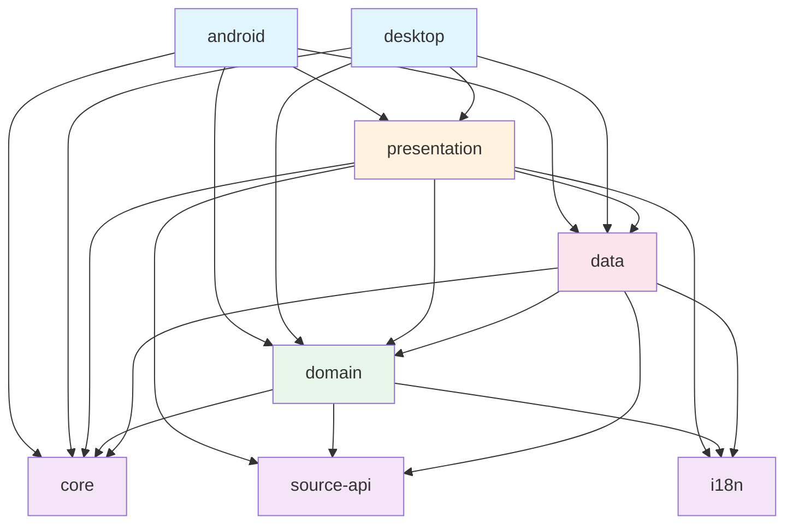

# Module Dependencies

This document provides a comprehensive overview of module dependencies in the IReader project.

## Module Dependency Graph



## Module Overview

| Module | Type | Purpose | Dependencies |
|--------|------|---------|--------------|
| `:android` | Application | Android app entry point | presentation, domain, data, core |
| `:desktop` | Application | Desktop app entry point | presentation, domain, data, core |
| `:presentation` | Library | UI layer (Compose) | domain, data, core, source-api, i18n |
| `:domain` | Library | Business logic | core, source-api, i18n |
| `:data` | Library | Data access | domain, core, source-api, i18n |
| `:core` | Library | Shared utilities | source-api, i18n |
| `:source-api` | Library | Extension API | i18n |
| `:i18n` | Library | Localization | (none) |

## Detailed Module Dependencies

### `:android`

**Purpose**: Android application entry point

**Direct Dependencies**:
- `:presentation` - UI screens and ViewModels
- `:domain` - Business logic and use cases
- `:data` - Data repositories
- `:core` - Utilities

**External Dependencies**:
- Android SDK
- Firebase (non-fdroid builds)
- Google Services (non-fdroid builds)

**Build Configuration**:
```kotlin
dependencies {
    implementation(project(":presentation"))
    implementation(project(":domain"))
    implementation(project(":data"))
    implementation(project(":core"))
}
```

---

### `:desktop`

**Purpose**: Desktop application entry point

**Direct Dependencies**:
- `:presentation` - UI screens and ViewModels
- `:domain` - Business logic and use cases
- `:data` - Data repositories
- `:core` - Utilities

**External Dependencies**:
- Compose Desktop
- Piper JNI (text-to-speech)
- LWJGL (native file dialogs)

**Build Configuration**:
```kotlin
dependencies {
    implementation(project(":presentation"))
    implementation(project(":domain"))
    implementation(project(":data"))
    implementation(project(":core"))
    implementation(compose.desktop.currentOs)
}
```

---

### `:presentation`

**Purpose**: UI layer with Jetpack Compose

**Direct Dependencies**:
- `:domain` - Use cases and domain models
- `:data` - Repository implementations (for DI)
- `:core` - Utilities and extensions
- `:source-api` - Source catalog interfaces
- `:i18n` - Localization resources

**External Dependencies**:
- Jetpack Compose (UI framework)
- Voyager (navigation)
- Koin (dependency injection)
- Coil (image loading)
- Material3 (design system)

**Key Responsibilities**:
- Compose screens and components
- ViewModels for state management
- Navigation logic
- User interaction handling

**Build Configuration**:
```kotlin
dependencies {
    implementation(project(":domain"))
    implementation(project(":data"))
    implementation(project(":core"))
    implementation(project(":source-api"))
    implementation(project(":i18n"))
    
    // Compose
    api(compose.foundation)
    api(compose.runtime)
    api(compose.material3)
    
    // Navigation
    implementation(libs.voyager.navigator)
    
    // DI
    api(libs.koin.core)
    api(libs.koin.compose)
    
    // Image loading
    api(libs.coil.core)
    api(libs.coil.compose)
}
```

---

### `:domain`

**Purpose**: Business logic and domain models

**Direct Dependencies**:
- `:core` - Shared utilities
- `:source-api` - Source extension contracts
- `:i18n` - Localization resources

**External Dependencies**:
- Kotlin Coroutines
- Kotlinx Serialization
- Ktor (HTTP client)
- Koin (dependency injection)
- Coil (image models)

**Key Responsibilities**:
- Use cases (business operations)
- Domain models (entities)
- Repository interfaces
- Business validation
- Domain services

**Architecture Violations to Fix**:
⚠️ Currently has Compose UI dependencies (will be removed in Task 5)

**Build Configuration**:
```kotlin
dependencies {
    implementation(project(":core"))
    implementation(project(":source-api"))
    implementation(project(":i18n"))
    
    // Core Kotlin
    api(kotlinx.coroutines.core)
    implementation(kotlinx.serialization.protobuf)
    implementation(kotlinx.datetime)
    
    // Networking
    implementation(libs.ktor.core)
    implementation(libs.ktor.contentNegotiation)
    
    // DI
    api(libs.koin.core)
    
    // Utilities
    implementation(libs.okio)
    implementation(libs.jsoup)
}
```

---

### `:data`

**Purpose**: Data access and storage

**Direct Dependencies**:
- `:domain` - Repository interfaces and domain models
- `:core` - Shared utilities
- `:source-api` - Source extension implementations
- `:i18n` - Localization resources

**External Dependencies**:
- SQLDelight (database)
- Ktor (HTTP client)
- Supabase (backend services)
- Kotlinx Serialization
- Koin (dependency injection)

**Key Responsibilities**:
- Repository implementations
- Database operations (SQLDelight)
- Network operations (Ktor)
- Data mapping (Entity ↔ Domain)
- Caching strategies

**Build Configuration**:
```kotlin
dependencies {
    implementation(project(":domain"))
    implementation(project(":core"))
    implementation(project(":source-api"))
    implementation(project(":i18n"))
    
    // Database
    implementation(libs.sqldelight.runtime)
    implementation(libs.sqldelight.coroutines)
    
    // Networking
    api(libs.bundles.ireader) // Ktor bundle
    
    // Backend
    implementation(libs.bundles.supabase)
    
    // DI
    api(libs.koin.core)
    
    // Serialization
    implementation(kotlinx.serialization.json)
}
```

---

### `:core`

**Purpose**: Shared utilities and platform abstractions

**Direct Dependencies**:
- `:source-api` - Source extension utilities
- `:i18n` - Localization resources

**External Dependencies**:
- Kotlin Coroutines
- Kotlinx Serialization
- Ktor (HTTP client)
- Multiplatform Settings (preferences)
- Koin (dependency injection)
- QuickJS (JavaScript engine)

**Key Responsibilities**:
- Platform-specific utilities
- Common extensions
- Shared constants
- Preference management
- JavaScript execution

**Build Configuration**:
```kotlin
dependencies {
    api(project(":source-api"))
    api(project(":i18n"))
    
    // Core Kotlin
    api(kotlinx.coroutines.core)
    api(kotlinx.stdlib)
    api(kotlinx.datetime)
    api(kotlinx.serialization.json)
    
    // Networking
    api(libs.ktor.core)
    api(libs.ktor.contentNegotiation)
    
    // Preferences
    api(libs.multiplatformSettings)
    api(libs.multiplatformSettings.coroutines)
    
    // DI
    api(libs.koin.core)
    
    // Utilities
    api(libs.okio)
    compileOnly(libs.jsoup)
}
```

---

### `:source-api`

**Purpose**: Extension API for content sources

**Direct Dependencies**:
- `:i18n` - Localization resources

**External Dependencies**:
- Minimal (mostly Kotlin stdlib)

**Key Responsibilities**:
- Source extension contracts
- Catalog interfaces
- Content provider abstractions

**Build Configuration**:
```kotlin
dependencies {
    api(project(":i18n"))
    // Minimal dependencies - just contracts
}
```

---

### `:i18n`

**Purpose**: Localization and internationalization

**Direct Dependencies**: None (leaf module)

**External Dependencies**:
- Moko Resources (multiplatform resources)

**Key Responsibilities**:
- String resources
- Translations
- Locale management

**Build Configuration**:
```kotlin
dependencies {
    api(libs.moko.core)
}
```

## Dependency Rules

### Allowed Dependencies

✅ **Presentation → Domain**: ViewModels use use cases
✅ **Presentation → Data**: For dependency injection setup
✅ **Data → Domain**: Repositories implement domain interfaces
✅ **Domain → Core**: Use shared utilities
✅ **Any → i18n**: Access localization resources

### Forbidden Dependencies

❌ **Domain → Presentation**: Domain must not know about UI
❌ **Domain → Data**: Domain defines interfaces, not implementations
❌ **Data → Presentation**: Data layer is independent of UI
❌ **Core → Domain/Data/Presentation**: Core is a utility layer

### Transitive Dependencies

Modules inherit dependencies from their dependencies:

- `:android` transitively depends on all modules
- `:presentation` transitively depends on `:domain`, `:core`, `:source-api`, `:i18n`
- `:data` transitively depends on `:domain`, `:core`, `:source-api`, `:i18n`

## External Dependency Categories

### Networking
- **Ktor**: HTTP client (all platforms)
- **OkHttp**: HTTP engine (Android/Desktop)
- **Supabase**: Backend services

### Database
- **SQLDelight**: Type-safe SQL (all platforms)
- **Requery SQLite**: SQLite implementation (Android)

### UI
- **Jetpack Compose**: UI framework
- **Material3**: Design system
- **Voyager**: Navigation
- **Coil**: Image loading

### Dependency Injection
- **Koin**: DI framework (all platforms)

### Serialization
- **Kotlinx Serialization**: JSON/Protobuf serialization

### Utilities
- **Okio**: File I/O
- **Jsoup**: HTML parsing
- **QuickJS**: JavaScript execution

## Version Management

All dependencies are managed through version catalogs in `gradle/`:

- `libs.versions.toml` - Main dependencies
- `kotlinx.versions.toml` - Kotlin libraries
- `androidx.versions.toml` - AndroidX libraries
- `compose.versions.toml` - Compose libraries
- `accompanist.versions.toml` - Accompanist libraries
- `testing.versions.toml` - Testing libraries

## Dependency Optimization

### Recent Optimizations

1. ✅ Removed unused Readium library
2. ✅ Consolidated to Material3 (removed Material2)
3. ✅ Removed duplicate dependency declarations
4. ✅ Consolidated Ktor dependencies into bundle

### Future Optimizations

1. ⚠️ Remove Compose dependencies from `:domain` (Task 5)
2. 🔄 Evaluate Supabase module usage
3. 🔄 Consider lighter alternatives for heavy dependencies

## Adding New Dependencies

### Process

1. **Evaluate necessity**: Is this dependency really needed?
2. **Check for alternatives**: Can existing dependencies be used?
3. **Add to version catalog**: Update appropriate `.toml` file
4. **Add to module**: Use in `build.gradle.kts`
5. **Document**: Update this file if it's a significant dependency

### Example

1. Add to `gradle/libs.versions.toml`:
```toml
[versions]
newlib = "1.0.0"

[libraries]
newlib-core = { module = "com.example:newlib", version.ref = "newlib" }
```

2. Use in module:
```kotlin
dependencies {
    implementation(libs.newlib.core)
}
```

## Troubleshooting

### Circular Dependencies

If you encounter circular dependencies:

1. Check the dependency graph above
2. Identify the cycle
3. Extract shared code to a lower-level module
4. Use interfaces to break the cycle

### Duplicate Dependencies

If you see duplicate dependency warnings:

1. Check if the dependency is declared in multiple modules
2. Use `api` in the lowest common module
3. Use `implementation` in consuming modules
4. Remove duplicate declarations

### Version Conflicts

If you encounter version conflicts:

1. Check version catalogs for consistency
2. Use `./gradlew dependencies` to see the dependency tree
3. Align versions in version catalogs
4. Use dependency resolution strategies if needed

## Build Performance

### Tips for Faster Builds

1. Use version catalogs (already implemented)
2. Enable configuration cache (already enabled)
3. Use Gradle build cache
4. Minimize transitive dependencies
5. Use `implementation` instead of `api` when possible
6. Keep modules focused and small

### Dependency Analysis

To analyze dependencies:

```bash
# View dependency tree for a module
./gradlew :domain:dependencies

# View all dependencies
./gradlew dependencies

# Find duplicate dependencies
./gradlew buildEnvironment
```

## References

- [Gradle Dependency Management](https://docs.gradle.org/current/userguide/dependency_management.html)
- [Kotlin Multiplatform](https://kotlinlang.org/docs/multiplatform.html)
- [Version Catalogs](https://docs.gradle.org/current/userguide/platforms.html)

---

**Last Updated**: 2025-11-13
**Version**: 1.0
