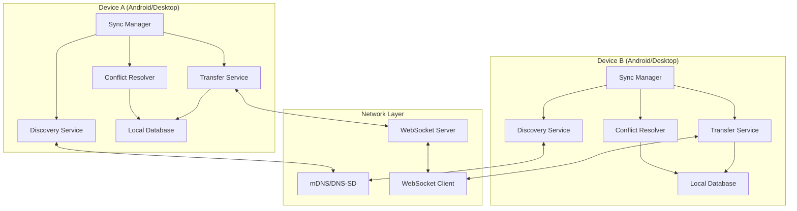
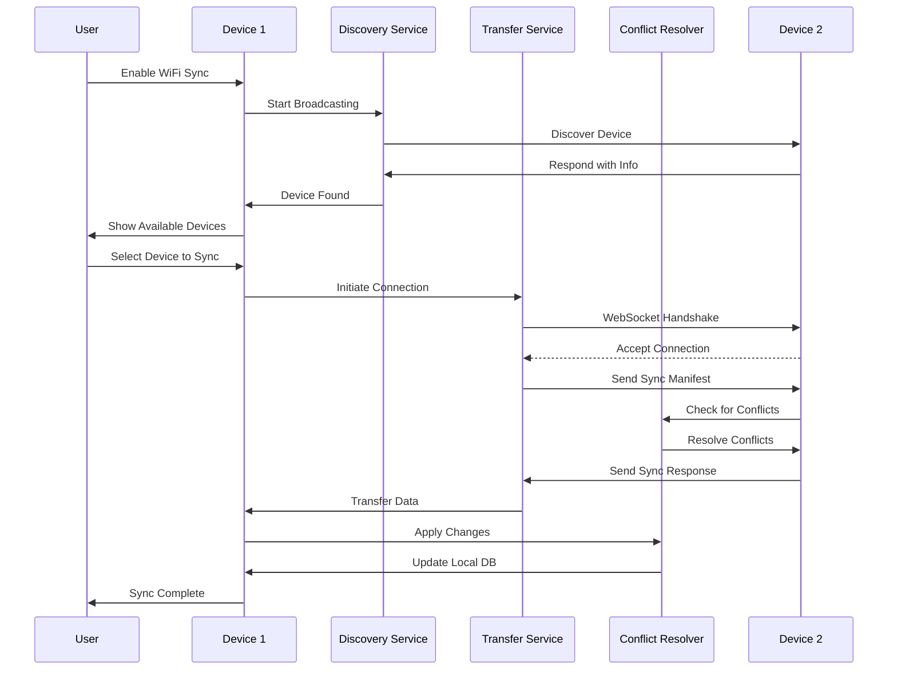

# Design Document: Local WiFi Book Sync

## Overview

The Local WiFi Book Sync feature enables seamless synchronization of books, reading progress, bookmarks, and book-related metadata between Android and Desktop devices when connected to the same WiFi network. This peer-to-peer synchronization system operates without requiring internet connectivity or cloud services, providing users with a fast, private, and reliable way to keep their reading experience consistent across devices. The system uses mDNS/DNS-SD for automatic device discovery, secure WebSocket connections for real-time data transfer, and conflict resolution strategies to handle simultaneous updates on multiple devices.

## Architecture




## Main Workflow



## Components and Interfaces

### Component 1: SyncManager

**Purpose**: Orchestrates the entire synchronization process, coordinating between discovery, transfer, and conflict resolution.

**Interface**:
```kotlin
interface SyncManager {
    // Start the sync service and begin broadcasting
    suspend fun startSync(): Result<Unit>
    
    // Stop the sync service
    suspend fun stopSync(): Result<Unit>
    
    // Get list of discovered devices
    fun getDiscoveredDevices(): Flow<List<DiscoveredDevice>>
    
    // Initiate sync with a specific device
    suspend fun syncWithDevice(deviceId: String): Result<SyncResult>
    
    // Get current sync status
    fun getSyncStatus(): Flow<SyncStatus>
    
    // Cancel ongoing sync
    suspend fun cancelSync(): Result<Unit>
}
```

**Responsibilities**:
- Lifecycle management of sync service
- Coordination between discovery and transfer components
- Status reporting and error handling
- User-initiated sync operations


### Component 2: DiscoveryService

**Purpose**: Handles device discovery on the local network using mDNS/DNS-SD protocol.

**Interface**:
```kotlin
interface DiscoveryService {
    // Start broadcasting this device's presence
    suspend fun startBroadcasting(deviceInfo: DeviceInfo): Result<Unit>
    
    // Stop broadcasting
    suspend fun stopBroadcasting(): Result<Unit>
    
    // Start discovering other devices
    suspend fun startDiscovery(): Result<Unit>
    
    // Stop discovering
    suspend fun stopDiscovery(): Result<Unit>
    
    // Stream of discovered devices
    fun observeDiscoveredDevices(): Flow<List<DiscoveredDevice>>
    
    // Verify device is still reachable
    suspend fun verifyDevice(deviceId: String): Result<Boolean>
}
```

**Responsibilities**:
- mDNS service registration and discovery
- Device information broadcasting
- Network change monitoring
- Device reachability verification

### Component 3: TransferService

**Purpose**: Manages data transfer between devices using WebSocket connections.

**Interface**:
```kotlin
interface TransferService {
    // Start WebSocket server (for receiving connections)
    suspend fun startServer(port: Int): Result<Unit>
    
    // Stop WebSocket server
    suspend fun stopServer(): Result<Unit>
    
    // Connect to remote device as client
    suspend fun connectToDevice(address: String, port: Int): Result<Connection>
    
    // Send sync data to connected device
    suspend fun sendSyncData(connection: Connection, data: SyncData): Result<Unit>
    
    // Receive sync data from connected device
    fun receiveSyncData(connection: Connection): Flow<SyncData>
    
    // Close connection
    suspend fun closeConnection(connection: Connection): Result<Unit>
}
```

**Responsibilities**:
- WebSocket server/client management
- Secure connection establishment
- Data serialization and transfer
- Connection lifecycle management
- Progress tracking


### Component 4: ConflictResolver

**Purpose**: Resolves conflicts when the same data has been modified on multiple devices.

**Interface**:
```kotlin
interface ConflictResolver {
    // Detect conflicts between local and remote data
    suspend fun detectConflicts(
        local: SyncData,
        remote: SyncData
    ): List<DataConflict>
    
    // Resolve conflicts using specified strategy
    suspend fun resolveConflicts(
        conflicts: List<DataConflict>,
        strategy: ConflictResolutionStrategy
    ): Result<ResolvedData>
    
    // Get conflict resolution strategy
    fun getStrategy(): ConflictResolutionStrategy
    
    // Set conflict resolution strategy
    suspend fun setStrategy(strategy: ConflictResolutionStrategy): Result<Unit>
}
```

**Responsibilities**:
- Conflict detection based on timestamps and versions
- Conflict resolution using configurable strategies
- Merge operations for compatible changes
- User notification for manual resolution

### Component 5: SyncRepository

**Purpose**: Manages local storage of sync-related data and metadata.

**Interface**:
```kotlin
interface SyncRepository {
    // Get all books that need syncing
    suspend fun getBooksToSync(): Result<List<BookSyncData>>
    
    // Get reading progress for all books
    suspend fun getReadingProgress(): Result<List<ReadingProgressData>>
    
    // Get bookmarks for all books
    suspend fun getBookmarks(): Result<List<BookmarkData>>
    
    // Update local data from sync
    suspend fun applySync(data: SyncData): Result<Unit>
    
    // Get last sync timestamp
    suspend fun getLastSyncTime(deviceId: String): Result<Long?>
    
    // Update last sync timestamp
    suspend fun updateLastSyncTime(deviceId: String, timestamp: Long): Result<Unit>
    
    // Get sync manifest (metadata about what needs syncing)
    suspend fun getSyncManifest(): Result<SyncManifest>
}
```

**Responsibilities**:
- Data extraction for synchronization
- Local database updates from sync
- Sync metadata management
- Timestamp tracking


## Data Models

### Model 1: DeviceInfo

```kotlin
data class DeviceInfo(
    val deviceId: String,           // Unique device identifier (UUID)
    val deviceName: String,          // User-friendly device name
    val deviceType: DeviceType,      // ANDROID or DESKTOP
    val appVersion: String,          // App version for compatibility check
    val ipAddress: String,           // Device IP address
    val port: Int,                   // WebSocket server port
    val lastSeen: Long               // Timestamp of last activity
)

enum class DeviceType {
    ANDROID,
    DESKTOP
}
```

**Validation Rules**:
- deviceId must be valid UUID format
- deviceName must not be empty
- port must be in range 1024-65535
- ipAddress must be valid IPv4 or IPv6 format
- lastSeen must be positive timestamp

### Model 2: DiscoveredDevice

```kotlin
data class DiscoveredDevice(
    val info: DeviceInfo,
    val isReachable: Boolean,
    val signalStrength: Int,         // 0-100, WiFi signal quality
    val discoveredAt: Long           // When device was discovered
)
```

**Validation Rules**:
- signalStrength must be in range 0-100
- discoveredAt must be positive timestamp

### Model 3: SyncData

```kotlin
data class SyncData(
    val books: List<BookSyncData>,
    val readingProgress: List<ReadingProgressData>,
    val bookmarks: List<BookmarkData>,
    val metadata: SyncMetadata
)

data class SyncMetadata(
    val deviceId: String,
    val timestamp: Long,
    val version: Int,                // Sync protocol version
    val checksum: String             // Data integrity verification
)
```

**Validation Rules**:
- timestamp must be positive
- version must match supported protocol versions
- checksum must be valid SHA-256 hash


### Model 4: BookSyncData

```kotlin
data class BookSyncData(
    val bookId: String,
    val title: String,
    val author: String?,
    val coverUrl: String?,
    val filePath: String?,           // Local file path (if book file exists)
    val fileHash: String?,           // SHA-256 hash of book file
    val fileSize: Long,              // File size in bytes
    val addedAt: Long,               // When book was added to library
    val updatedAt: Long,             // Last modification timestamp
    val metadata: Map<String, String> // Additional book metadata
)
```

**Validation Rules**:
- bookId must not be empty
- title must not be empty
- fileSize must be non-negative
- addedAt and updatedAt must be positive timestamps
- fileHash must be valid SHA-256 if present

### Model 5: ReadingProgressData

```kotlin
data class ReadingProgressData(
    val bookId: String,
    val chapterIndex: Int,
    val chapterOffset: Int,          // Character offset within chapter
    val progress: Float,             // 0.0 to 1.0
    val lastReadAt: Long,            // Timestamp of last read
    val totalReadingTime: Long       // Total time spent reading (milliseconds)
)
```

**Validation Rules**:
- bookId must not be empty
- chapterIndex must be non-negative
- chapterOffset must be non-negative
- progress must be in range 0.0 to 1.0
- lastReadAt must be positive timestamp
- totalReadingTime must be non-negative

### Model 6: BookmarkData

```kotlin
data class BookmarkData(
    val bookmarkId: String,
    val bookId: String,
    val chapterIndex: Int,
    val chapterOffset: Int,
    val note: String?,
    val createdAt: Long
)
```

**Validation Rules**:
- bookmarkId must not be empty
- bookId must not be empty
- chapterIndex must be non-negative
- chapterOffset must be non-negative
- createdAt must be positive timestamp


### Model 7: DataConflict

```kotlin
data class DataConflict(
    val type: ConflictType,
    val localData: Any,
    val remoteData: Any,
    val conflictField: String
)

enum class ConflictType {
    READING_PROGRESS,
    BOOKMARK,
    BOOK_METADATA
}

enum class ConflictResolutionStrategy {
    LATEST_TIMESTAMP,    // Use data with most recent timestamp
    MANUAL,              // Require user to choose
    LOCAL_WINS,          // Always prefer local data
    REMOTE_WINS,         // Always prefer remote data
    MERGE                // Attempt to merge both changes
}
```

### Model 8: SyncStatus

```kotlin
sealed class SyncStatus {
    object Idle : SyncStatus()
    object Discovering : SyncStatus()
    data class Connecting(val deviceName: String) : SyncStatus()
    data class Syncing(
        val deviceName: String,
        val progress: Float,         // 0.0 to 1.0
        val currentItem: String
    ) : SyncStatus()
    data class Completed(
        val deviceName: String,
        val syncedItems: Int,
        val duration: Long
    ) : SyncStatus()
    data class Failed(
        val deviceName: String?,
        val error: SyncError
    ) : SyncStatus()
}

sealed class SyncError {
    object NetworkUnavailable : SyncError()
    object DeviceNotFound : SyncError()
    object ConnectionFailed : SyncError()
    object AuthenticationFailed : SyncError()
    object IncompatibleVersion : SyncError()
    data class TransferFailed(val reason: String) : SyncError()
    data class ConflictResolutionFailed(val conflicts: List<DataConflict>) : SyncError()
}
```

### Model 9: SyncManifest

```kotlin
data class SyncManifest(
    val deviceInfo: DeviceInfo,
    val bookCount: Int,
    val totalSize: Long,             // Total size of all books in bytes
    val lastSyncTime: Long?,
    val items: List<SyncManifestItem>
)

data class SyncManifestItem(
    val bookId: String,
    val title: String,
    val fileHash: String?,
    val fileSize: Long,
    val lastModified: Long
)
```


## Key Functions with Formal Specifications

### Function 1: startSync()

```kotlin
suspend fun SyncManager.startSync(): Result<Unit>
```

**Preconditions:**
- WiFi is enabled and connected
- App has necessary network permissions
- No sync operation is currently in progress

**Postconditions:**
- Discovery service is broadcasting device presence
- WebSocket server is listening on configured port
- Sync status is updated to `Discovering`
- Returns `Success` if started successfully, `Failure` with error otherwise

**Loop Invariants:** N/A

### Function 2: syncWithDevice()

```kotlin
suspend fun SyncManager.syncWithDevice(deviceId: String): Result<SyncResult>
```

**Preconditions:**
- `deviceId` is not empty
- Device with `deviceId` exists in discovered devices list
- Device is reachable on the network
- No other sync operation is in progress

**Postconditions:**
- Connection established with remote device
- Sync manifest exchanged
- Conflicts detected and resolved
- Data transferred and applied to local database
- Sync status updated to `Completed` or `Failed`
- Returns `SyncResult` with details of sync operation

**Loop Invariants:** N/A

### Function 3: detectConflicts()

```kotlin
suspend fun ConflictResolver.detectConflicts(
    local: SyncData,
    remote: SyncData
): List<DataConflict>
```

**Preconditions:**
- `local` and `remote` are non-null and valid SyncData objects
- Both contain valid metadata with timestamps

**Postconditions:**
- Returns list of detected conflicts (may be empty)
- Each conflict contains both local and remote versions
- Conflicts are categorized by type
- No modifications to input data

**Loop Invariants:**
- For each item processed: all previously checked items remain in consistent state
- Conflict list grows monotonically during iteration


### Function 4: resolveConflicts()

```kotlin
suspend fun ConflictResolver.resolveConflicts(
    conflicts: List<DataConflict>,
    strategy: ConflictResolutionStrategy
): Result<ResolvedData>
```

**Preconditions:**
- `conflicts` list is not null (may be empty)
- `strategy` is a valid ConflictResolutionStrategy
- For MANUAL strategy: user interaction is available

**Postconditions:**
- All conflicts are resolved according to strategy
- Returns `ResolvedData` containing merged/chosen data
- If strategy is MANUAL and user cancels: returns Failure
- No unresolved conflicts remain in result

**Loop Invariants:**
- All previously resolved conflicts remain valid
- Resolution strategy is applied consistently to all conflicts

### Function 5: transferBookFile()

```kotlin
suspend fun TransferService.transferBookFile(
    connection: Connection,
    bookData: BookSyncData
): Result<Unit>
```

**Preconditions:**
- `connection` is active and valid
- `bookData.filePath` exists and is readable
- `bookData.fileHash` matches actual file hash
- Sufficient storage space on receiving device

**Postconditions:**
- File transferred completely to remote device
- File integrity verified via checksum
- Progress updates emitted during transfer
- Returns Success if transfer complete, Failure otherwise
- Connection remains open after transfer

**Loop Invariants:**
- Total bytes transferred ≤ file size
- Checksum calculation remains consistent
- Connection stays active throughout transfer


## Algorithmic Pseudocode

### Main Synchronization Algorithm

```kotlin
suspend fun performSync(deviceId: String): Result<SyncResult> {
    // Precondition: deviceId is valid and device is reachable
    require(deviceId.isNotEmpty()) { "Device ID must not be empty" }
    
    return try {
        // Step 1: Establish connection
        updateStatus(SyncStatus.Connecting(deviceName))
        val connection = transferService.connectToDevice(
            address = device.ipAddress,
            port = device.port
        ).getOrThrow()
        
        // Step 2: Exchange sync manifests
        val localManifest = syncRepository.getSyncManifest().getOrThrow()
        transferService.sendSyncData(connection, localManifest).getOrThrow()
        
        val remoteManifest = transferService.receiveSyncData(connection)
            .first()
            .getOrThrow()
        
        // Step 3: Determine what needs syncing
        val syncPlan = calculateSyncPlan(localManifest, remoteManifest)
        
        // Step 4: Transfer data with progress tracking
        updateStatus(SyncStatus.Syncing(deviceName, 0f, "Starting..."))
        
        var itemsProcessed = 0
        val totalItems = syncPlan.itemsToSend.size + syncPlan.itemsToReceive.size
        
        // Send local data to remote
        for (item in syncPlan.itemsToSend) {
            // Loop invariant: itemsProcessed ≤ totalItems
            val data = syncRepository.getDataForItem(item).getOrThrow()
            transferService.sendSyncData(connection, data).getOrThrow()
            
            itemsProcessed++
            val progress = itemsProcessed.toFloat() / totalItems
            updateStatus(SyncStatus.Syncing(deviceName, progress, item.title))
        }
        
        // Receive remote data
        for (item in syncPlan.itemsToReceive) {
            // Loop invariant: itemsProcessed ≤ totalItems
            val data = transferService.receiveSyncData(connection).first().getOrThrow()
            
            // Detect and resolve conflicts
            val conflicts = conflictResolver.detectConflicts(
                local = syncRepository.getDataForItem(item).getOrNull(),
                remote = data
            )
            
            if (conflicts.isNotEmpty()) {
                val resolved = conflictResolver.resolveConflicts(
                    conflicts,
                    conflictResolver.getStrategy()
                ).getOrThrow()
                syncRepository.applySync(resolved).getOrThrow()
            } else {
                syncRepository.applySync(data).getOrThrow()
            }
            
            itemsProcessed++
            val progress = itemsProcessed.toFloat() / totalItems
            updateStatus(SyncStatus.Syncing(deviceName, progress, item.title))
        }
        
        // Step 5: Update sync timestamp
        syncRepository.updateLastSyncTime(deviceId, System.currentTimeMillis())
        
        // Step 6: Close connection
        transferService.closeConnection(connection)
        
        val result = SyncResult(
            deviceId = deviceId,
            itemsSynced = itemsProcessed,
            duration = System.currentTimeMillis() - startTime
        )
        
        updateStatus(SyncStatus.Completed(deviceName, itemsProcessed, result.duration))
        Result.success(result)
        
    } catch (e: Exception) {
        updateStatus(SyncStatus.Failed(deviceName, e.toSyncError()))
        Result.failure(e)
    }
}
```

**Preconditions:**
- deviceId is valid and not empty
- Device is reachable on network
- WiFi connection is active
- No other sync in progress

**Postconditions:**
- All syncable data is transferred
- Conflicts are resolved
- Local database is updated
- Sync timestamp is recorded
- Status reflects completion or failure

**Loop Invariants:**
- itemsProcessed ≤ totalItems throughout execution
- Progress value is always in range [0.0, 1.0]
- Connection remains active during transfer loops


### Device Discovery Algorithm

```kotlin
suspend fun discoverDevices(): Flow<List<DiscoveredDevice>> = flow {
    // Precondition: WiFi is connected, mDNS service is available
    
    val discoveredDevices = mutableMapOf<String, DiscoveredDevice>()
    
    // Start mDNS service discovery
    val serviceType = "_ireader-sync._tcp"
    val mdnsListener = object : ServiceDiscoveryListener {
        override fun onServiceFound(service: ServiceInfo) {
            // Parse device info from mDNS TXT records
            val deviceInfo = DeviceInfo(
                deviceId = service.getAttribute("deviceId"),
                deviceName = service.getAttribute("deviceName"),
                deviceType = DeviceType.valueOf(service.getAttribute("deviceType")),
                appVersion = service.getAttribute("appVersion"),
                ipAddress = service.host,
                port = service.port,
                lastSeen = System.currentTimeMillis()
            )
            
            val discovered = DiscoveredDevice(
                info = deviceInfo,
                isReachable = true,
                signalStrength = calculateSignalStrength(service),
                discoveredAt = System.currentTimeMillis()
            )
            
            discoveredDevices[deviceInfo.deviceId] = discovered
            emit(discoveredDevices.values.toList())
        }
        
        override fun onServiceLost(service: ServiceInfo) {
            val deviceId = service.getAttribute("deviceId")
            discoveredDevices.remove(deviceId)
            emit(discoveredDevices.values.toList())
        }
    }
    
    mdnsService.discoverServices(serviceType, mdnsListener)
    
    // Periodically verify device reachability
    while (currentCoroutineContext().isActive) {
        delay(30_000) // Check every 30 seconds
        
        for ((deviceId, device) in discoveredDevices) {
            // Loop invariant: All devices in map have been discovered
            val isReachable = verifyDeviceReachability(device.info)
            
            if (!isReachable) {
                discoveredDevices[deviceId] = device.copy(isReachable = false)
            }
        }
        
        emit(discoveredDevices.values.toList())
    }
}
```

**Preconditions:**
- WiFi is connected
- mDNS service is available on platform
- Network permissions granted

**Postconditions:**
- Flow emits updated device list on changes
- Unreachable devices are marked accordingly
- Service discovery continues until cancelled

**Loop Invariants:**
- All devices in discoveredDevices map have been discovered via mDNS
- Device reachability is verified periodically
- Flow emissions are consistent with current state


### Conflict Detection Algorithm

```kotlin
suspend fun detectConflicts(local: SyncData, remote: SyncData): List<DataConflict> {
    // Precondition: local and remote are valid SyncData objects
    require(local.metadata.timestamp > 0) { "Local timestamp must be positive" }
    require(remote.metadata.timestamp > 0) { "Remote timestamp must be positive" }
    
    val conflicts = mutableListOf<DataConflict>()
    
    // Check reading progress conflicts
    val localProgressMap = local.readingProgress.associateBy { it.bookId }
    val remoteProgressMap = remote.readingProgress.associateBy { it.bookId }
    
    for ((bookId, localProgress) in localProgressMap) {
        // Loop invariant: All previously checked books have no undetected conflicts
        val remoteProgress = remoteProgressMap[bookId] ?: continue
        
        // Conflict if both modified after last sync and values differ
        if (localProgress.lastReadAt != remoteProgress.lastReadAt &&
            localProgress.chapterIndex != remoteProgress.chapterIndex) {
            
            conflicts.add(DataConflict(
                type = ConflictType.READING_PROGRESS,
                localData = localProgress,
                remoteData = remoteProgress,
                conflictField = "chapterIndex"
            ))
        }
    }
    
    // Check bookmark conflicts
    val localBookmarkMap = local.bookmarks.associateBy { it.bookmarkId }
    val remoteBookmarkMap = remote.bookmarks.associateBy { it.bookmarkId }
    
    for ((bookmarkId, localBookmark) in localBookmarkMap) {
        // Loop invariant: All previously checked bookmarks have no undetected conflicts
        val remoteBookmark = remoteBookmarkMap[bookmarkId] ?: continue
        
        // Conflict if same bookmark modified differently
        if (localBookmark.note != remoteBookmark.note ||
            localBookmark.chapterOffset != remoteBookmark.chapterOffset) {
            
            conflicts.add(DataConflict(
                type = ConflictType.BOOKMARK,
                localData = localBookmark,
                remoteData = remoteBookmark,
                conflictField = "content"
            ))
        }
    }
    
    // Check book metadata conflicts
    val localBookMap = local.books.associateBy { it.bookId }
    val remoteBookMap = remote.books.associateBy { it.bookId }
    
    for ((bookId, localBook) in localBookMap) {
        // Loop invariant: All previously checked books have no undetected conflicts
        val remoteBook = remoteBookMap[bookId] ?: continue
        
        // Conflict if metadata differs and both modified after last sync
        if (localBook.updatedAt != remoteBook.updatedAt &&
            localBook.metadata != remoteBook.metadata) {
            
            conflicts.add(DataConflict(
                type = ConflictType.BOOK_METADATA,
                localData = localBook,
                remoteData = remoteBook,
                conflictField = "metadata"
            ))
        }
    }
    
    return conflicts
}
```

**Preconditions:**
- local and remote are non-null valid SyncData
- Both have positive timestamps in metadata

**Postconditions:**
- Returns list of all detected conflicts
- No modifications to input data
- Conflicts are properly categorized

**Loop Invariants:**
- All previously processed items have been checked for conflicts
- Conflict list grows monotonically
- No duplicate conflicts in result


### Conflict Resolution Algorithm

```kotlin
suspend fun resolveConflicts(
    conflicts: List<DataConflict>,
    strategy: ConflictResolutionStrategy
): Result<ResolvedData> {
    // Precondition: conflicts list is not null, strategy is valid
    
    val resolvedData = mutableListOf<Any>()
    
    for (conflict in conflicts) {
        // Loop invariant: All previously resolved conflicts are in resolvedData
        
        val resolved = when (strategy) {
            ConflictResolutionStrategy.LATEST_TIMESTAMP -> {
                resolveByTimestamp(conflict)
            }
            
            ConflictResolutionStrategy.LOCAL_WINS -> {
                conflict.localData
            }
            
            ConflictResolutionStrategy.REMOTE_WINS -> {
                conflict.remoteData
            }
            
            ConflictResolutionStrategy.MERGE -> {
                attemptMerge(conflict).getOrElse {
                    // If merge fails, fall back to latest timestamp
                    resolveByTimestamp(conflict)
                }
            }
            
            ConflictResolutionStrategy.MANUAL -> {
                // Request user input
                val userChoice = requestUserResolution(conflict).getOrElse {
                    return Result.failure(
                        Exception("User cancelled conflict resolution")
                    )
                }
                userChoice
            }
        }
        
        resolvedData.add(resolved)
    }
    
    return Result.success(ResolvedData(resolvedData))
}

private fun resolveByTimestamp(conflict: DataConflict): Any {
    return when (conflict.type) {
        ConflictType.READING_PROGRESS -> {
            val local = conflict.localData as ReadingProgressData
            val remote = conflict.remoteData as ReadingProgressData
            if (local.lastReadAt > remote.lastReadAt) local else remote
        }
        ConflictType.BOOKMARK -> {
            val local = conflict.localData as BookmarkData
            val remote = conflict.remoteData as BookmarkData
            if (local.createdAt > remote.createdAt) local else remote
        }
        ConflictType.BOOK_METADATA -> {
            val local = conflict.localData as BookSyncData
            val remote = conflict.remoteData as BookSyncData
            if (local.updatedAt > remote.updatedAt) local else remote
        }
    }
}

private fun attemptMerge(conflict: DataConflict): Result<Any> {
    return when (conflict.type) {
        ConflictType.READING_PROGRESS -> {
            // Use furthest reading position
            val local = conflict.localData as ReadingProgressData
            val remote = conflict.remoteData as ReadingProgressData
            
            val merged = if (local.progress > remote.progress) {
                local.copy(
                    totalReadingTime = maxOf(local.totalReadingTime, remote.totalReadingTime)
                )
            } else {
                remote.copy(
                    totalReadingTime = maxOf(local.totalReadingTime, remote.totalReadingTime)
                )
            }
            Result.success(merged)
        }
        
        ConflictType.BOOKMARK -> {
            // Keep both bookmarks if different positions
            Result.failure(Exception("Cannot merge bookmarks"))
        }
        
        ConflictType.BOOK_METADATA -> {
            // Merge metadata maps
            val local = conflict.localData as BookSyncData
            val remote = conflict.remoteData as BookSyncData
            
            val mergedMetadata = local.metadata + remote.metadata
            val merged = local.copy(
                metadata = mergedMetadata,
                updatedAt = maxOf(local.updatedAt, remote.updatedAt)
            )
            Result.success(merged)
        }
    }
}
```

**Preconditions:**
- conflicts list is not null (may be empty)
- strategy is valid ConflictResolutionStrategy
- For MANUAL: user interaction available

**Postconditions:**
- All conflicts resolved according to strategy
- Returns ResolvedData with merged/chosen data
- If MANUAL and user cancels: returns Failure

**Loop Invariants:**
- All previously resolved conflicts are in resolvedData
- Resolution strategy applied consistently
- No unresolved conflicts remain


## Example Usage

### Example 1: Starting Sync Service

```kotlin
// Initialize sync manager
val syncManager = SyncManagerImpl(
    discoveryService = discoveryService,
    transferService = transferService,
    conflictResolver = conflictResolver,
    syncRepository = syncRepository
)

// Start sync service
lifecycleScope.launch {
    syncManager.startSync()
        .onSuccess {
            println("Sync service started successfully")
        }
        .onFailure { error ->
            println("Failed to start sync: ${error.message}")
        }
}

// Observe discovered devices
lifecycleScope.launch {
    syncManager.getDiscoveredDevices()
        .collect { devices ->
            println("Found ${devices.size} devices:")
            devices.forEach { device ->
                println("  - ${device.info.deviceName} (${device.info.deviceType})")
            }
        }
}
```

### Example 2: Syncing with a Device

```kotlin
// User selects a device to sync with
val selectedDeviceId = "device-uuid-123"

lifecycleScope.launch {
    // Observe sync status
    launch {
        syncManager.getSyncStatus()
            .collect { status ->
                when (status) {
                    is SyncStatus.Idle -> {
                        println("Ready to sync")
                    }
                    is SyncStatus.Connecting -> {
                        println("Connecting to ${status.deviceName}...")
                    }
                    is SyncStatus.Syncing -> {
                        val percent = (status.progress * 100).toInt()
                        println("Syncing: $percent% - ${status.currentItem}")
                    }
                    is SyncStatus.Completed -> {
                        println("Sync completed: ${status.syncedItems} items in ${status.duration}ms")
                    }
                    is SyncStatus.Failed -> {
                        println("Sync failed: ${status.error}")
                    }
                    else -> {}
                }
            }
    }
    
    // Initiate sync
    syncManager.syncWithDevice(selectedDeviceId)
        .onSuccess { result ->
            println("Sync successful: ${result.itemsSynced} items synced")
        }
        .onFailure { error ->
            println("Sync failed: ${error.message}")
        }
}
```

### Example 3: Configuring Conflict Resolution

```kotlin
// Set conflict resolution strategy
lifecycleScope.launch {
    conflictResolver.setStrategy(ConflictResolutionStrategy.LATEST_TIMESTAMP)
        .onSuccess {
            println("Conflict resolution strategy updated")
        }
}

// Or use manual resolution for important conflicts
lifecycleScope.launch {
    conflictResolver.setStrategy(ConflictResolutionStrategy.MANUAL)
    
    // When conflicts occur, user will be prompted
    syncManager.syncWithDevice(deviceId)
        .onFailure { error ->
            if (error is ConflictResolutionException) {
                // Show conflict resolution UI
                showConflictResolutionDialog(error.conflicts)
            }
        }
}
```

### Example 4: Complete Workflow

```kotlin
class SyncViewModel(
    private val syncManager: SyncManager,
    private val conflictResolver: ConflictResolver
) : ViewModel() {
    
    val discoveredDevices = syncManager.getDiscoveredDevices()
        .stateIn(viewModelScope, SharingStarted.Lazily, emptyList())
    
    val syncStatus = syncManager.getSyncStatus()
        .stateIn(viewModelScope, SharingStarted.Lazily, SyncStatus.Idle)
    
    fun startSyncService() {
        viewModelScope.launch {
            syncManager.startSync()
        }
    }
    
    fun syncWithDevice(deviceId: String) {
        viewModelScope.launch {
            syncManager.syncWithDevice(deviceId)
        }
    }
    
    fun stopSyncService() {
        viewModelScope.launch {
            syncManager.stopSync()
        }
    }
}

// In Composable UI
@Composable
fun SyncScreen(viewModel: SyncViewModel) {
    val devices by viewModel.discoveredDevices.collectAsState()
    val status by viewModel.syncStatus.collectAsState()
    
    Column {
        Button(onClick = { viewModel.startSyncService() }) {
            Text("Start Sync Service")
        }
        
        when (val currentStatus = status) {
            is SyncStatus.Syncing -> {
                LinearProgressIndicator(progress = currentStatus.progress)
                Text("Syncing: ${currentStatus.currentItem}")
            }
            is SyncStatus.Completed -> {
                Text("Sync completed: ${currentStatus.syncedItems} items")
            }
            else -> {}
        }
        
        LazyColumn {
            items(devices) { device ->
                DeviceItem(
                    device = device,
                    onSyncClick = { viewModel.syncWithDevice(device.info.deviceId) }
                )
            }
        }
    }
}
```


## Correctness Properties

### Universal Quantification Statements

1. **Data Integrity**: ∀ book transfers, the file hash of the received book must match the hash in the manifest
   ```kotlin
   property("transferred book integrity") {
       forAll(bookTransfers) { transfer ->
           val receivedHash = calculateHash(transfer.receivedFile)
           receivedHash == transfer.manifest.fileHash
       }
   }
   ```

2. **Conflict Detection Completeness**: ∀ data items modified on both devices after last sync, a conflict must be detected
   ```kotlin
   property("conflict detection completeness") {
       forAll(syncPairs) { (local, remote) ->
           val modifiedOnBoth = local.items.filter { localItem ->
               remote.items.any { remoteItem ->
                   remoteItem.id == localItem.id &&
                   localItem.modifiedAfter(lastSync) &&
                   remoteItem.modifiedAfter(lastSync) &&
                   localItem != remoteItem
               }
           }
           
           val detectedConflicts = detectConflicts(local, remote)
           modifiedOnBoth.all { item ->
               detectedConflicts.any { it.itemId == item.id }
           }
       }
   }
   ```

3. **Sync Idempotency**: ∀ sync operations, syncing twice with no changes should result in no data transfer
   ```kotlin
   property("sync idempotency") {
       forAll(devices) { device ->
           val firstSync = performSync(device)
           val secondSync = performSync(device)
           
           secondSync.itemsTransferred == 0
       }
   }
   ```

4. **Progress Monotonicity**: ∀ sync operations, progress value must be monotonically increasing
   ```kotlin
   property("progress monotonicity") {
       forAll(syncOperations) { sync ->
           val progressValues = sync.statusUpdates
               .filterIsInstance<SyncStatus.Syncing>()
               .map { it.progress }
           
           progressValues.zipWithNext().all { (prev, next) ->
               next >= prev
           }
       }
   }
   ```

5. **Device Discovery Consistency**: ∀ discovered devices, if device A discovers device B, then device B must be able to discover device A
   ```kotlin
   property("device discovery symmetry") {
       forAll(devicePairs) { (deviceA, deviceB) ->
           val aDiscoversB = deviceA.discoveredDevices.contains(deviceB.id)
           val bDiscoversA = deviceB.discoveredDevices.contains(deviceA.id)
           
           aDiscoversB implies bDiscoversA
       }
   }
   ```

6. **Conflict Resolution Determinism**: ∀ conflicts with same strategy, resolution must be deterministic
   ```kotlin
   property("conflict resolution determinism") {
       forAll(conflicts, strategies) { conflict, strategy ->
           val resolution1 = resolveConflict(conflict, strategy)
           val resolution2 = resolveConflict(conflict, strategy)
           
           resolution1 == resolution2
       }
   }
   ```

7. **Connection Cleanup**: ∀ sync operations (successful or failed), all connections must be closed
   ```kotlin
   property("connection cleanup") {
       forAll(syncOperations) { sync ->
           val openConnectionsBefore = getOpenConnections()
           performSync(sync)
           val openConnectionsAfter = getOpenConnections()
           
           openConnectionsAfter == openConnectionsBefore
       }
   }
   ```

8. **Timestamp Consistency**: ∀ synced items, the lastSyncTime must be ≥ all item timestamps
   ```kotlin
   property("timestamp consistency") {
       forAll(syncResults) { result ->
           val lastSyncTime = result.lastSyncTime
           result.syncedItems.all { item ->
               item.timestamp <= lastSyncTime
           }
       }
   }
   ```


## Error Handling

### Error Scenario 1: Network Connection Lost During Sync

**Condition**: WiFi connection drops or becomes unstable during active sync operation

**Response**: 
- Detect connection loss via timeout or socket error
- Pause current transfer operation
- Update sync status to `Failed` with `NetworkUnavailable` error
- Clean up open connections and resources
- Save partial progress if possible

**Recovery**:
- Automatically retry connection up to 3 times with exponential backoff
- If retry fails, notify user and allow manual retry
- Resume from last successful checkpoint if supported
- User can cancel and restart sync from beginning

### Error Scenario 2: Incompatible App Versions

**Condition**: Devices have different app versions with incompatible sync protocols

**Response**:
- Check version compatibility during initial handshake
- Compare sync protocol versions in device manifests
- Reject connection if versions are incompatible
- Update sync status to `Failed` with `IncompatibleVersion` error
- Display clear error message to user

**Recovery**:
- Prompt user to update app on older device
- Provide link to app store or download page
- Allow user to dismiss and try with different device
- Log version mismatch for debugging

### Error Scenario 3: Insufficient Storage Space

**Condition**: Receiving device doesn't have enough space for incoming books

**Response**:
- Check available storage before accepting transfer
- Calculate total size needed from sync manifest
- Reject transfer if insufficient space
- Update sync status to `Failed` with `InsufficientStorage` error
- Show required vs available space to user

**Recovery**:
- Prompt user to free up storage space
- Offer selective sync (choose specific books)
- Allow user to cancel sync
- Retry after user confirms space is available

### Error Scenario 4: File Corruption During Transfer

**Condition**: Transferred file hash doesn't match expected hash

**Response**:
- Verify file hash after each book transfer
- Detect mismatch between received and expected hash
- Delete corrupted file immediately
- Mark transfer as failed for that specific book
- Continue with remaining books in sync queue

**Recovery**:
- Automatically retry failed book transfer up to 3 times
- If retry fails, skip book and continue with others
- Log failed books for user review
- Allow user to manually retry failed books later


### Error Scenario 5: Conflict Resolution Failure

**Condition**: Unable to automatically resolve conflicts, or user cancels manual resolution

**Response**:
- Detect unresolvable conflicts during sync
- If strategy is MANUAL, prompt user for resolution
- If user cancels or timeout occurs, abort sync
- Update sync status to `Failed` with `ConflictResolutionFailed` error
- Preserve both local and remote data (no data loss)

**Recovery**:
- Save conflict details for later review
- Allow user to change conflict resolution strategy
- Provide conflict resolution UI for manual review
- User can retry sync after resolving conflicts
- Option to skip conflicted items and sync others

### Error Scenario 6: Device Becomes Unreachable

**Condition**: Target device goes offline or leaves network during discovery/sync

**Response**:
- Detect device unreachability via ping/heartbeat failure
- Update device status to unreachable in discovered devices list
- If sync in progress, pause and wait for reconnection
- After timeout (30 seconds), fail the sync operation
- Update sync status to `Failed` with `DeviceNotFound` error

**Recovery**:
- Continue monitoring for device to come back online
- Automatically resume sync if device returns within grace period
- Notify user if device remains offline
- Allow user to cancel or wait for device
- Remove device from list after extended absence (5 minutes)

### Error Scenario 7: Permission Denied

**Condition**: App lacks necessary permissions (network, storage, etc.)

**Response**:
- Check permissions before starting sync operations
- Detect permission denial during runtime
- Immediately stop sync operation
- Update sync status to `Failed` with `PermissionDenied` error
- Show permission rationale to user

**Recovery**:
- Request missing permissions from user
- Provide clear explanation of why permissions are needed
- Retry sync after permissions granted
- Gracefully degrade if optional permissions denied
- Guide user to app settings if permissions permanently denied


## Testing Strategy

### Unit Testing Approach

Unit tests will focus on individual components in isolation, using mocks for dependencies. Key areas:

**SyncManager Tests**:
- Test lifecycle management (start/stop sync)
- Test device selection and sync initiation
- Test status updates and error propagation
- Mock all dependencies (discovery, transfer, conflict resolver)

**DiscoveryService Tests**:
- Test mDNS service registration and discovery
- Test device information parsing
- Test reachability verification
- Mock network layer and mDNS APIs

**TransferService Tests**:
- Test WebSocket server/client lifecycle
- Test data serialization and deserialization
- Test connection management
- Test progress tracking
- Mock network sockets and connections

**ConflictResolver Tests**:
- Test conflict detection logic with various scenarios
- Test each resolution strategy independently
- Test merge operations for compatible changes
- Use deterministic test data

**SyncRepository Tests**:
- Test data extraction from local database
- Test sync data application
- Test timestamp management
- Mock database layer

**Test Coverage Goals**: 80%+ for business logic, 100% for conflict resolution algorithms

### Property-Based Testing Approach

Property-based tests will verify correctness properties hold for all possible inputs.

**Property Test Library**: Kotest Property Testing (supports Kotlin Multiplatform)

**Key Properties to Test**:

1. **Data Integrity Property**:
   ```kotlin
   @Test
   fun `transferred files maintain integrity`() = runTest {
       checkAll(Arb.bookSyncData()) { bookData ->
           val transferred = transferAndReceive(bookData)
           transferred.fileHash shouldBe bookData.fileHash
       }
   }
   ```

2. **Conflict Detection Completeness**:
   ```kotlin
   @Test
   fun `all modified items are checked for conflicts`() = runTest {
       checkAll(Arb.syncDataPair()) { (local, remote) ->
           val conflicts = detectConflicts(local, remote)
           val modifiedItems = findModifiedItems(local, remote)
           modifiedItems.all { item ->
               conflicts.any { it.itemId == item.id } || item.isCompatible()
           }
       }
   }
   ```

3. **Sync Idempotency**:
   ```kotlin
   @Test
   fun `syncing twice with no changes transfers nothing`() = runTest {
       checkAll(Arb.devicePair()) { (device1, device2) ->
           performSync(device1, device2)
           val secondSync = performSync(device1, device2)
           secondSync.itemsTransferred shouldBe 0
       }
   }
   ```

4. **Progress Monotonicity**:
   ```kotlin
   @Test
   fun `sync progress is monotonically increasing`() = runTest {
       checkAll(Arb.syncOperation()) { sync ->
           val progressValues = collectProgressValues(sync)
           progressValues.zipWithNext().all { (prev, next) -> next >= prev }
       }
   }
   ```

5. **Conflict Resolution Determinism**:
   ```kotlin
   @Test
   fun `conflict resolution is deterministic`() = runTest {
       checkAll(Arb.dataConflict(), Arb.resolutionStrategy()) { conflict, strategy ->
           val resolution1 = resolveConflict(conflict, strategy)
           val resolution2 = resolveConflict(conflict, strategy)
           resolution1 shouldBe resolution2
       }
   }
   ```

### Integration Testing Approach

Integration tests will verify components work together correctly.

**Test Scenarios**:

1. **End-to-End Sync Flow**:
   - Start sync service on both devices
   - Discover devices
   - Initiate sync
   - Transfer data
   - Verify data consistency
   - Clean up connections

2. **Network Interruption Handling**:
   - Start sync operation
   - Simulate network disconnection mid-transfer
   - Verify proper error handling
   - Verify resource cleanup
   - Test reconnection and retry logic

3. **Concurrent Sync Operations**:
   - Attempt multiple simultaneous syncs
   - Verify proper queuing or rejection
   - Ensure no data corruption

4. **Large Dataset Sync**:
   - Sync library with 100+ books
   - Verify memory usage stays reasonable
   - Verify progress tracking accuracy
   - Test cancellation during large transfer

**Platform-Specific Integration Tests**:
- Android: Test with actual mDNS service (NsdManager)
- Desktop: Test with JmDNS library
- Both: Test WebSocket connections with Ktor


## Performance Considerations

### Network Efficiency

**Incremental Sync**: Only transfer books and data that have changed since last sync
- Maintain sync manifest with file hashes and timestamps
- Compare manifests before transfer to determine delta
- Skip unchanged files to minimize bandwidth usage

**Compression**: Compress data during transfer to reduce network load
- Use gzip compression for JSON metadata
- Consider compression for book files (if not already compressed formats like EPUB)
- Balance compression ratio vs CPU usage

**Chunked Transfer**: Split large files into chunks for better progress tracking and resumability
- Use 1MB chunks for book files
- Allow resume from last successful chunk on connection failure
- Implement parallel chunk transfer for multiple books

**Connection Pooling**: Reuse WebSocket connections for multiple transfers
- Keep connection alive for entire sync session
- Implement heartbeat mechanism to detect stale connections
- Close connections gracefully after sync completion

### Memory Management

**Streaming**: Stream large files instead of loading entirely into memory
- Use Kotlin Flow for streaming data transfer
- Process chunks as they arrive
- Limit in-memory buffer size to 10MB

**Resource Cleanup**: Ensure proper cleanup of resources
- Close file handles after transfer
- Release network buffers
- Cancel coroutines on sync cancellation
- Use `use` blocks for automatic resource management

**Database Batching**: Batch database operations for better performance
- Insert/update multiple records in single transaction
- Use batch size of 50-100 records
- Commit after each batch to prevent memory buildup

### Concurrency

**Coroutine Dispatchers**: Use appropriate dispatchers for different operations
- `Dispatchers.IO` for network and file operations
- `Dispatchers.Default` for CPU-intensive tasks (hashing, compression)
- `Dispatchers.Main` for UI updates

**Parallel Processing**: Process independent operations concurrently
- Discover devices while preparing sync manifest
- Transfer multiple small files in parallel (max 3 concurrent)
- Calculate file hashes in background

**Synchronization**: Prevent race conditions in shared state
- Use `Mutex` for critical sections
- Use atomic operations for counters
- Ensure thread-safe access to sync status

### Battery Optimization

**Wake Locks**: Acquire wake lock only during active transfer
- Release immediately after sync completion
- Use partial wake lock (screen can turn off)
- Respect battery saver mode

**Background Restrictions**: Handle Android background execution limits
- Use foreground service for active sync
- Show persistent notification during sync
- Respect Doze mode restrictions

**Adaptive Sync**: Adjust sync behavior based on battery level
- Skip large file transfers if battery < 20%
- Reduce discovery frequency on low battery
- Offer "sync on charger only" option


## Security Considerations

### Authentication

**Device Pairing**: Implement secure device pairing before first sync
- Generate unique device ID on first launch
- Use PIN-based pairing for initial connection
- Display 6-digit PIN on both devices for verification
- Store paired device IDs in secure storage

**Trust Management**: Maintain list of trusted devices
- Require user approval for new devices
- Allow user to revoke trust for devices
- Auto-expire trust after configurable period (default: 30 days)
- Re-authenticate after trust expiration

### Data Encryption

**Transport Encryption**: Encrypt all data in transit
- Use TLS/SSL for WebSocket connections
- Generate self-signed certificates for local network
- Implement certificate pinning for paired devices
- Use AES-256 for additional payload encryption

**At-Rest Encryption**: Protect sensitive data on device
- Encrypt sync metadata in local database
- Use Android Keystore / Desktop secure storage for keys
- Encrypt temporary files during transfer
- Securely wipe temporary files after use

### Access Control

**Permission Validation**: Verify permissions before operations
- Check network permissions before starting sync
- Verify storage permissions before file transfer
- Request permissions with clear rationale
- Handle permission denial gracefully

**Network Restrictions**: Limit sync to trusted networks
- Only allow sync on private WiFi networks
- Block sync on public/open WiFi by default
- Allow user to whitelist specific networks
- Detect network changes and pause sync if needed

### Privacy

**Data Minimization**: Only sync necessary data
- Don't sync personal notes unless explicitly enabled
- Exclude sensitive metadata by default
- Allow user to configure what data to sync
- Provide clear privacy policy for sync feature

**Local-Only Operation**: Ensure no data leaves local network
- No cloud services involved in sync
- No telemetry or analytics for sync operations
- All data stays on user's devices
- Verify no DNS leaks or external connections

### Threat Mitigation

**Man-in-the-Middle Protection**:
- Use certificate pinning for paired devices
- Verify device identity on each connection
- Detect and alert on certificate changes
- Implement challenge-response authentication

**Denial of Service Protection**:
- Rate limit connection attempts
- Implement connection timeout (30 seconds)
- Limit concurrent connections (max 1 active sync)
- Validate data size before accepting transfer

**Data Integrity**:
- Verify file hashes after transfer
- Use checksums for all transferred data
- Detect and reject tampered data
- Log integrity violations for debugging


## Dependencies

### Network Libraries

**Ktor Client** (already in project):
- Version: 3.4.0
- Purpose: WebSocket client/server implementation
- Platforms: Android, Desktop, iOS
- Usage: Data transfer between devices

**mDNS/DNS-SD**:
- Android: NsdManager (built-in Android API)
- Desktop: JmDNS library (version 3.5.9)
- Purpose: Device discovery on local network
- Note: Platform-specific implementations required

### Serialization

**Kotlinx Serialization** (already in project):
- Purpose: Serialize/deserialize sync data
- Format: JSON for metadata, binary for files
- Usage: SyncData, DeviceInfo, manifests

### Coroutines

**Kotlinx Coroutines** (already in project):
- Purpose: Asynchronous operations
- Usage: Network I/O, file operations, concurrent processing
- Dispatchers: IO, Default, Main

### Database

**SQLDelight** (already in project):
- Version: 2.2.1
- Purpose: Local data storage and queries
- Usage: Sync metadata, timestamps, device trust list

### Security

**Kotlin Crypto**:
- Library: kotlinx-crypto (if available) or platform-specific
- Purpose: Encryption, hashing, secure random
- Usage: File hashing (SHA-256), data encryption (AES-256)

**Platform Secure Storage**:
- Android: EncryptedSharedPreferences / Keystore
- Desktop: Java Keystore
- Purpose: Store device keys, paired device IDs

### Testing

**Kotest** (for property-based testing):
- Version: 5.8.0
- Purpose: Property-based testing framework
- Platforms: JVM (Android, Desktop)

**MockK** (already in project):
- Version: 1.14.9
- Purpose: Mocking for unit tests
- Usage: Mock network, database, platform APIs

**Kotlinx Coroutines Test** (already in project):
- Purpose: Testing coroutines
- Usage: Test async operations, flows

### Platform-Specific

**Android**:
- NsdManager: Device discovery
- WorkManager: Background sync scheduling (optional)
- Foreground Service: Keep sync alive in background

**Desktop**:
- JmDNS: Device discovery (add to dependencies)
- Java NIO: File operations
- Swing Coroutines: UI updates (already available)

### Optional Enhancements

**Compression**:
- Library: kotlinx-io or platform-specific
- Purpose: Compress data during transfer
- Usage: Reduce bandwidth for large transfers

**Progress Tracking**:
- Library: Built-in with Ktor and Kotlin Flow
- Purpose: Track transfer progress
- Usage: Update UI with sync progress

